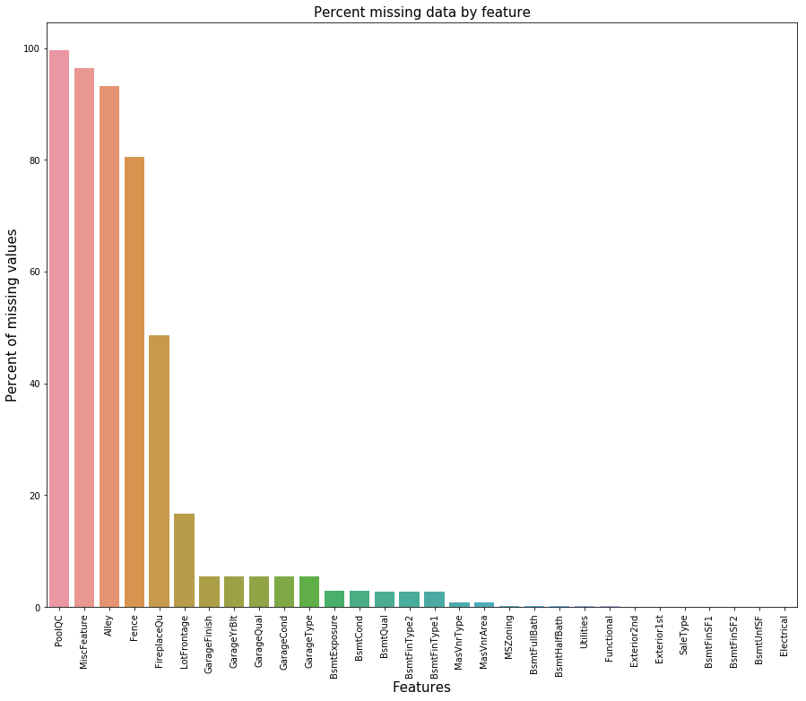

Objective :
1. To see what Factors contribute the most to the Housing Prices
2. To perform EDA to see the recent trend in the Market and to find interesting Patterns and relationships
3. To create a model that accurately predicts the house price based on the factors that a client comes up with

Business Problem : This can be looked at from two perspective

1. Buyer Perspective : Often buyers dont know what is the exact price for an apartment or they often tend to get cheated with inflated price for a very mediocre facilities available. The model helps the buyer to get the exact price of the house based on his/her requirements. Say he comes with few requirements like xyz, I can give him the expected sale price of that house and he will be in a better position in knowing the price range for his choice. Also this creates a business for me from many such Customers.

2. Seller's Perspective : Say I am an owner who is about to sell my house. I want to know what is the current trend of buyingg and the factors affecting my House sale. By contacting a website/House Predicting Service company, i can pay some amount and get the data from them,who has all the trends and patterns observed, and also the factors that contribute the most . Also i can get the estimated price for my house based on my conditions. In this way a service company is making funds and also the Owner knows how to get a good value for his sale.


# Import Packages


```python
import numpy as np
import pandas as pd
import matplotlib.pyplot as plt
import seaborn as sns
import math
from scipy import stats
from scipy.stats import norm
%matplotlib inline

```

# Reading the data 

The data is obtained from The kaggle website competition.
https://www.kaggle.com/c/house-prices-advanced-regression-techniques/data


```python
df_train= pd.read_csv('train.csv')  # the training Data set
```


```python
df_test = pd.read_csv('test.csv')  # the test Data set
```


```python
#Examine the training data set
df_train.head()
```


<div>
<style scoped>
    .dataframe tbody tr th:only-of-type {
        vertical-align: middle;
    }

    .dataframe tbody tr th {
        vertical-align: top;
    }

    .dataframe thead th {
        text-align: right;
    }
</style>
<table border="1" class="dataframe">
  <thead>
    <tr style="text-align: right;">
      <th></th>
      <th>Id</th>
      <th>MSSubClass</th>
      <th>MSZoning</th>
      <th>LotFrontage</th>
      <th>LotArea</th>
      <th>Street</th>
      <th>Alley</th>
      <th>LotShape</th>
      <th>LandContour</th>
      <th>Utilities</th>
      <th>...</th>
      <th>PoolArea</th>
      <th>PoolQC</th>
      <th>Fence</th>
      <th>MiscFeature</th>
      <th>MiscVal</th>
      <th>MoSold</th>
      <th>YrSold</th>
      <th>SaleType</th>
      <th>SaleCondition</th>
      <th>SalePrice</th>
    </tr>
  </thead>
  <tbody>
    <tr>
      <th>0</th>
      <td>1</td>
      <td>60</td>
      <td>RL</td>
      <td>65.0</td>
      <td>8450</td>
      <td>Pave</td>
      <td>NaN</td>
      <td>Reg</td>
      <td>Lvl</td>
      <td>AllPub</td>
      <td>...</td>
      <td>0</td>
      <td>NaN</td>
      <td>NaN</td>
      <td>NaN</td>
      <td>0</td>
      <td>2</td>
      <td>2008</td>
      <td>WD</td>
      <td>Normal</td>
      <td>208500</td>
    </tr>
    <tr>
      <th>1</th>
      <td>2</td>
      <td>20</td>
      <td>RL</td>
      <td>80.0</td>
      <td>9600</td>
      <td>Pave</td>
      <td>NaN</td>
      <td>Reg</td>
      <td>Lvl</td>
      <td>AllPub</td>
      <td>...</td>
      <td>0</td>
      <td>NaN</td>
      <td>NaN</td>
      <td>NaN</td>
      <td>0</td>
      <td>5</td>
      <td>2007</td>
      <td>WD</td>
      <td>Normal</td>
      <td>181500</td>
    </tr>
    <tr>
      <th>2</th>
      <td>3</td>
      <td>60</td>
      <td>RL</td>
      <td>68.0</td>
      <td>11250</td>
      <td>Pave</td>
      <td>NaN</td>
      <td>IR1</td>
      <td>Lvl</td>
      <td>AllPub</td>
      <td>...</td>
      <td>0</td>
      <td>NaN</td>
      <td>NaN</td>
      <td>NaN</td>
      <td>0</td>
      <td>9</td>
      <td>2008</td>
      <td>WD</td>
      <td>Normal</td>
      <td>223500</td>
    </tr>
    <tr>
      <th>3</th>
      <td>4</td>
      <td>70</td>
      <td>RL</td>
      <td>60.0</td>
      <td>9550</td>
      <td>Pave</td>
      <td>NaN</td>
      <td>IR1</td>
      <td>Lvl</td>
      <td>AllPub</td>
      <td>...</td>
      <td>0</td>
      <td>NaN</td>
      <td>NaN</td>
      <td>NaN</td>
      <td>0</td>
      <td>2</td>
      <td>2006</td>
      <td>WD</td>
      <td>Abnorml</td>
      <td>140000</td>
    </tr>
    <tr>
      <th>4</th>
      <td>5</td>
      <td>60</td>
      <td>RL</td>
      <td>84.0</td>
      <td>14260</td>
      <td>Pave</td>
      <td>NaN</td>
      <td>IR1</td>
      <td>Lvl</td>
      <td>AllPub</td>
      <td>...</td>
      <td>0</td>
      <td>NaN</td>
      <td>NaN</td>
      <td>NaN</td>
      <td>0</td>
      <td>12</td>
      <td>2008</td>
      <td>WD</td>
      <td>Normal</td>
      <td>250000</td>
    </tr>
  </tbody>
</table>
<p>5 rows × 81 columns</p>
</div>


```python
#seeing the test data set
df_test.head()
```


<div>
<style scoped>
    .dataframe tbody tr th:only-of-type {
        vertical-align: middle;
    }

    .dataframe tbody tr th {
        vertical-align: top;
    }

    .dataframe thead th {
        text-align: right;
    }
</style>
<table border="1" class="dataframe">
  <thead>
    <tr style="text-align: right;">
      <th></th>
      <th>Id</th>
      <th>MSSubClass</th>
      <th>MSZoning</th>
      <th>LotFrontage</th>
      <th>LotArea</th>
      <th>Street</th>
      <th>Alley</th>
      <th>LotShape</th>
      <th>LandContour</th>
      <th>Utilities</th>
      <th>...</th>
      <th>ScreenPorch</th>
      <th>PoolArea</th>
      <th>PoolQC</th>
      <th>Fence</th>
      <th>MiscFeature</th>
      <th>MiscVal</th>
      <th>MoSold</th>
      <th>YrSold</th>
      <th>SaleType</th>
      <th>SaleCondition</th>
    </tr>
  </thead>
  <tbody>
    <tr>
      <th>0</th>
      <td>1461</td>
      <td>20</td>
      <td>RH</td>
      <td>80.0</td>
      <td>11622</td>
      <td>Pave</td>
      <td>NaN</td>
      <td>Reg</td>
      <td>Lvl</td>
      <td>AllPub</td>
      <td>...</td>
      <td>120</td>
      <td>0</td>
      <td>NaN</td>
      <td>MnPrv</td>
      <td>NaN</td>
      <td>0</td>
      <td>6</td>
      <td>2010</td>
      <td>WD</td>
      <td>Normal</td>
    </tr>
    <tr>
      <th>1</th>
      <td>1462</td>
      <td>20</td>
      <td>RL</td>
      <td>81.0</td>
      <td>14267</td>
      <td>Pave</td>
      <td>NaN</td>
      <td>IR1</td>
      <td>Lvl</td>
      <td>AllPub</td>
      <td>...</td>
      <td>0</td>
      <td>0</td>
      <td>NaN</td>
      <td>NaN</td>
      <td>Gar2</td>
      <td>12500</td>
      <td>6</td>
      <td>2010</td>
      <td>WD</td>
      <td>Normal</td>
    </tr>
    <tr>
      <th>2</th>
      <td>1463</td>
      <td>60</td>
      <td>RL</td>
      <td>74.0</td>
      <td>13830</td>
      <td>Pave</td>
      <td>NaN</td>
      <td>IR1</td>
      <td>Lvl</td>
      <td>AllPub</td>
      <td>...</td>
      <td>0</td>
      <td>0</td>
      <td>NaN</td>
      <td>MnPrv</td>
      <td>NaN</td>
      <td>0</td>
      <td>3</td>
      <td>2010</td>
      <td>WD</td>
      <td>Normal</td>
    </tr>
    <tr>
      <th>3</th>
      <td>1464</td>
      <td>60</td>
      <td>RL</td>
      <td>78.0</td>
      <td>9978</td>
      <td>Pave</td>
      <td>NaN</td>
      <td>IR1</td>
      <td>Lvl</td>
      <td>AllPub</td>
      <td>...</td>
      <td>0</td>
      <td>0</td>
      <td>NaN</td>
      <td>NaN</td>
      <td>NaN</td>
      <td>0</td>
      <td>6</td>
      <td>2010</td>
      <td>WD</td>
      <td>Normal</td>
    </tr>
    <tr>
      <th>4</th>
      <td>1465</td>
      <td>120</td>
      <td>RL</td>
      <td>43.0</td>
      <td>5005</td>
      <td>Pave</td>
      <td>NaN</td>
      <td>IR1</td>
      <td>HLS</td>
      <td>AllPub</td>
      <td>...</td>
      <td>144</td>
      <td>0</td>
      <td>NaN</td>
      <td>NaN</td>
      <td>NaN</td>
      <td>0</td>
      <td>1</td>
      <td>2010</td>
      <td>WD</td>
      <td>Normal</td>
    </tr>
  </tbody>
</table>
<p>5 rows × 80 columns</p>
</div>


```python
df_train.info()
```

    <class 'pandas.core.frame.DataFrame'>
    RangeIndex: 1460 entries, 0 to 1459
    Data columns (total 81 columns):
    Id               1460 non-null int64
    MSSubClass       1460 non-null int64
    MSZoning         1460 non-null object
    LotFrontage      1201 non-null float64
    LotArea          1460 non-null int64
    Street           1460 non-null object
    Alley            91 non-null object
    LotShape         1460 non-null object
    LandContour      1460 non-null object
    Utilities        1460 non-null object
    LotConfig        1460 non-null object
    LandSlope        1460 non-null object
    Neighborhood     1460 non-null object
    Condition1       1460 non-null object
    Condition2       1460 non-null object
    BldgType         1460 non-null object
    HouseStyle       1460 non-null object
    OverallQual      1460 non-null int64
    OverallCond      1460 non-null int64
    YearBuilt        1460 non-null int64
    YearRemodAdd     1460 non-null int64
    RoofStyle        1460 non-null object
    RoofMatl         1460 non-null object
    Exterior1st      1460 non-null object
    Exterior2nd      1460 non-null object
    MasVnrType       1452 non-null object
    MasVnrArea       1452 non-null float64
    ExterQual        1460 non-null object
    ExterCond        1460 non-null object
    Foundation       1460 non-null object
    BsmtQual         1423 non-null object
    BsmtCond         1423 non-null object
    BsmtExposure     1422 non-null object
    BsmtFinType1     1423 non-null object
    BsmtFinSF1       1460 non-null int64
    BsmtFinType2     1422 non-null object
    BsmtFinSF2       1460 non-null int64
    BsmtUnfSF        1460 non-null int64
    TotalBsmtSF      1460 non-null int64
    Heating          1460 non-null object
    HeatingQC        1460 non-null object
    CentralAir       1460 non-null object
    Electrical       1459 non-null object
    1stFlrSF         1460 non-null int64
    2ndFlrSF         1460 non-null int64
    LowQualFinSF     1460 non-null int64
    GrLivArea        1460 non-null int64
    BsmtFullBath     1460 non-null int64
    BsmtHalfBath     1460 non-null int64
    FullBath         1460 non-null int64
    HalfBath         1460 non-null int64
    BedroomAbvGr     1460 non-null int64
    KitchenAbvGr     1460 non-null int64
    KitchenQual      1460 non-null object
    TotRmsAbvGrd     1460 non-null int64
    Functional       1460 non-null object
    Fireplaces       1460 non-null int64
    FireplaceQu      770 non-null object
    GarageType       1379 non-null object
    GarageYrBlt      1379 non-null float64
    GarageFinish     1379 non-null object
    GarageCars       1460 non-null int64
    GarageArea       1460 non-null int64
    GarageQual       1379 non-null object
    GarageCond       1379 non-null object
    PavedDrive       1460 non-null object
    WoodDeckSF       1460 non-null int64
    OpenPorchSF      1460 non-null int64
    EnclosedPorch    1460 non-null int64
    3SsnPorch        1460 non-null int64
    ScreenPorch      1460 non-null int64
    PoolArea         1460 non-null int64
    PoolQC           7 non-null object
    Fence            281 non-null object
    MiscFeature      54 non-null object
    MiscVal          1460 non-null int64
    MoSold           1460 non-null int64
    YrSold           1460 non-null int64
    SaleType         1460 non-null object
    SaleCondition    1460 non-null object
    SalePrice        1460 non-null int64
    dtypes: float64(3), int64(35), object(43)
    memory usage: 924.0+ KB
    


```python
df_test.info()
```

    <class 'pandas.core.frame.DataFrame'>
    RangeIndex: 1459 entries, 0 to 1458
    Data columns (total 80 columns):
    Id               1459 non-null int64
    MSSubClass       1459 non-null int64
    MSZoning         1455 non-null object
    LotFrontage      1232 non-null float64
    LotArea          1459 non-null int64
    Street           1459 non-null object
    Alley            107 non-null object
    LotShape         1459 non-null object
    LandContour      1459 non-null object
    Utilities        1457 non-null object
    LotConfig        1459 non-null object
    LandSlope        1459 non-null object
    Neighborhood     1459 non-null object
    Condition1       1459 non-null object
    Condition2       1459 non-null object
    BldgType         1459 non-null object
    HouseStyle       1459 non-null object
    OverallQual      1459 non-null int64
    OverallCond      1459 non-null int64
    YearBuilt        1459 non-null int64
    YearRemodAdd     1459 non-null int64
    RoofStyle        1459 non-null object
    RoofMatl         1459 non-null object
    Exterior1st      1458 non-null object
    Exterior2nd      1458 non-null object
    MasVnrType       1443 non-null object
    MasVnrArea       1444 non-null float64
    ExterQual        1459 non-null object
    ExterCond        1459 non-null object
    Foundation       1459 non-null object
    BsmtQual         1415 non-null object
    BsmtCond         1414 non-null object
    BsmtExposure     1415 non-null object
    BsmtFinType1     1417 non-null object
    BsmtFinSF1       1458 non-null float64
    BsmtFinType2     1417 non-null object
    BsmtFinSF2       1458 non-null float64
    BsmtUnfSF        1458 non-null float64
    TotalBsmtSF      1458 non-null float64
    Heating          1459 non-null object
    HeatingQC        1459 non-null object
    CentralAir       1459 non-null object
    Electrical       1459 non-null object
    1stFlrSF         1459 non-null int64
    2ndFlrSF         1459 non-null int64
    LowQualFinSF     1459 non-null int64
    GrLivArea        1459 non-null int64
    BsmtFullBath     1457 non-null float64
    BsmtHalfBath     1457 non-null float64
    FullBath         1459 non-null int64
    HalfBath         1459 non-null int64
    BedroomAbvGr     1459 non-null int64
    KitchenAbvGr     1459 non-null int64
    KitchenQual      1458 non-null object
    TotRmsAbvGrd     1459 non-null int64
    Functional       1457 non-null object
    Fireplaces       1459 non-null int64
    FireplaceQu      729 non-null object
    GarageType       1383 non-null object
    GarageYrBlt      1381 non-null float64
    GarageFinish     1381 non-null object
    GarageCars       1458 non-null float64
    GarageArea       1458 non-null float64
    GarageQual       1381 non-null object
    GarageCond       1381 non-null object
    PavedDrive       1459 non-null object
    WoodDeckSF       1459 non-null int64
    OpenPorchSF      1459 non-null int64
    EnclosedPorch    1459 non-null int64
    3SsnPorch        1459 non-null int64
    ScreenPorch      1459 non-null int64
    PoolArea         1459 non-null int64
    PoolQC           3 non-null object
    Fence            290 non-null object
    MiscFeature      51 non-null object
    MiscVal          1459 non-null int64
    MoSold           1459 non-null int64
    YrSold           1459 non-null int64
    SaleType         1458 non-null object
    SaleCondition    1459 non-null object
    dtypes: float64(11), int64(26), object(43)
    memory usage: 912.0+ KB
    

WE see that there ate 1460 entries in Training data and 1459 entries in the Test Data.
The variable MSSubClass is categorical, However it is classiffied as Numerical, let us correct this mistake before we proceed with further process


```python
df_train['MSSubClass'] = df_train['MSSubClass'].apply(str)
df_test['MSSubClass'] = df_test['MSSubClass'].apply(str)
```

# Data quality Check


```python
# checking if there are any missing values in any of the columns in the training data set
df_train.isnull().any()
```


    Id               False
    MSSubClass       False
    MSZoning         False
    LotFrontage       True
    LotArea          False
    Street           False
    Alley             True
    LotShape         False
    LandContour      False
    Utilities        False
    LotConfig        False
    LandSlope        False
    Neighborhood     False
    Condition1       False
    Condition2       False
    BldgType         False
    HouseStyle       False
    OverallQual      False
    OverallCond      False
    YearBuilt        False
    YearRemodAdd     False
    RoofStyle        False
    RoofMatl         False
    Exterior1st      False
    Exterior2nd      False
    MasVnrType        True
    MasVnrArea        True
    ExterQual        False
    ExterCond        False
    Foundation       False
                     ...  
    BedroomAbvGr     False
    KitchenAbvGr     False
    KitchenQual      False
    TotRmsAbvGrd     False
    Functional       False
    Fireplaces       False
    FireplaceQu       True
    GarageType        True
    GarageYrBlt       True
    GarageFinish      True
    GarageCars       False
    GarageArea       False
    GarageQual        True
    GarageCond        True
    PavedDrive       False
    WoodDeckSF       False
    OpenPorchSF      False
    EnclosedPorch    False
    3SsnPorch        False
    ScreenPorch      False
    PoolArea         False
    PoolQC            True
    Fence             True
    MiscFeature       True
    MiscVal          False
    MoSold           False
    YrSold           False
    SaleType         False
    SaleCondition    False
    SalePrice        False
    Length: 81, dtype: bool


```python
# checking if there are any missing values in any of the columns in the test data set
df_test.isnull().any()
```


    Id               False
    MSSubClass       False
    MSZoning          True
    LotFrontage       True
    LotArea          False
    Street           False
    Alley             True
    LotShape         False
    LandContour      False
    Utilities         True
    LotConfig        False
    LandSlope        False
    Neighborhood     False
    Condition1       False
    Condition2       False
    BldgType         False
    HouseStyle       False
    OverallQual      False
    OverallCond      False
    YearBuilt        False
    YearRemodAdd     False
    RoofStyle        False
    RoofMatl         False
    Exterior1st       True
    Exterior2nd       True
    MasVnrType        True
    MasVnrArea        True
    ExterQual        False
    ExterCond        False
    Foundation       False
                     ...  
    HalfBath         False
    BedroomAbvGr     False
    KitchenAbvGr     False
    KitchenQual       True
    TotRmsAbvGrd     False
    Functional        True
    Fireplaces       False
    FireplaceQu       True
    GarageType        True
    GarageYrBlt       True
    GarageFinish      True
    GarageCars        True
    GarageArea        True
    GarageQual        True
    GarageCond        True
    PavedDrive       False
    WoodDeckSF       False
    OpenPorchSF      False
    EnclosedPorch    False
    3SsnPorch        False
    ScreenPorch      False
    PoolArea         False
    PoolQC            True
    Fence             True
    MiscFeature       True
    MiscVal          False
    MoSold           False
    YrSold           False
    SaleType          True
    SaleCondition    False
    Length: 80, dtype: bool


```python
# to get a better idea of missing data , we can create a seaborn heatmap to see where we are missing data
sns.heatmap(df_train.isnull(),yticklabels=False,cbar=False,cmap='viridis')
```


    <matplotlib.axes._subplots.AxesSubplot at 0x24837c71080>


```python
sns.heatmap(df_test.isnull(),yticklabels=False,cbar=False,cmap='viridis')
```


    <matplotlib.axes._subplots.AxesSubplot at 0x24837f25400>


We see that missing data pattern  look similar on the variables in Training and Test data set. Let us explore this more in scrubbing the data.

# Cleaning the data


Let us merge both the training and the test data set together and start analying why the data is missing and by how much it is missing for each variable


```python
combined_data =pd.concat((df_train.drop(['Id', 'SalePrice'], axis = 1),
                      df_test.drop(['Id'], axis = 1))).reset_index(drop=True)
print(df_train.shape)
print(df_test.shape)
print(combined_data.shape)


ntrain = df_train.shape[0]
ntest = df_test.shape[0]

```

    (1460, 81)
    (1459, 80)
    (2919, 79)
    

Alright now that we have the total data set of training and test set , we shall ANalyse the missing values


```python
sns.heatmap(combined_data.isnull(),yticklabels=False,cbar=False,cmap='viridis')
```


    <matplotlib.axes._subplots.AxesSubplot at 0x24832d98a58>


We see that the missing data is maximum for PoolQC, Alley, MiscFeature and Fireplaces at the overview of the diagram


```python
combined_data_na = (combined_data.isnull().sum() / combined_data.shape[0])*100
combined_data_na = combined_data_na.drop(combined_data_na[combined_data_na == 0].index).sort_values(ascending=False)[:30]
missing_data = pd.DataFrame({'Missing Ratio' :combined_data_na})
missing_data.head(20)
```


<div>
<style scoped>
    .dataframe tbody tr th:only-of-type {
        vertical-align: middle;
    }

    .dataframe tbody tr th {
        vertical-align: top;
    }

    .dataframe thead th {
        text-align: right;
    }
</style>
<table border="1" class="dataframe">
  <thead>
    <tr style="text-align: right;">
      <th></th>
      <th>Missing Ratio</th>
    </tr>
  </thead>
  <tbody>
    <tr>
      <th>PoolQC</th>
      <td>99.657417</td>
    </tr>
    <tr>
      <th>MiscFeature</th>
      <td>96.402878</td>
    </tr>
    <tr>
      <th>Alley</th>
      <td>93.216855</td>
    </tr>
    <tr>
      <th>Fence</th>
      <td>80.438506</td>
    </tr>
    <tr>
      <th>FireplaceQu</th>
      <td>48.646797</td>
    </tr>
    <tr>
      <th>LotFrontage</th>
      <td>16.649538</td>
    </tr>
    <tr>
      <th>GarageFinish</th>
      <td>5.447071</td>
    </tr>
    <tr>
      <th>GarageYrBlt</th>
      <td>5.447071</td>
    </tr>
    <tr>
      <th>GarageQual</th>
      <td>5.447071</td>
    </tr>
    <tr>
      <th>GarageCond</th>
      <td>5.447071</td>
    </tr>
    <tr>
      <th>GarageType</th>
      <td>5.378554</td>
    </tr>
    <tr>
      <th>BsmtExposure</th>
      <td>2.809181</td>
    </tr>
    <tr>
      <th>BsmtCond</th>
      <td>2.809181</td>
    </tr>
    <tr>
      <th>BsmtQual</th>
      <td>2.774923</td>
    </tr>
    <tr>
      <th>BsmtFinType2</th>
      <td>2.740665</td>
    </tr>
    <tr>
      <th>BsmtFinType1</th>
      <td>2.706406</td>
    </tr>
    <tr>
      <th>MasVnrType</th>
      <td>0.822199</td>
    </tr>
    <tr>
      <th>MasVnrArea</th>
      <td>0.787941</td>
    </tr>
    <tr>
      <th>MSZoning</th>
      <td>0.137033</td>
    </tr>
    <tr>
      <th>BsmtFullBath</th>
      <td>0.068517</td>
    </tr>
  </tbody>
</table>
</div>


```python
f, ax = plt.subplots(figsize=(15, 12))
plt.xticks(rotation='90')
sns.barplot(x=combined_data_na.index, y=combined_data_na)
plt.xlabel('Features', fontsize=15)
plt.ylabel('Percent of missing values', fontsize=15)
plt.title('Percent missing data by feature', fontsize=15)
```


    Text(0.5,1,'Percent missing data by feature')





```python
# All columns where missing values can be replaced with 'None'
for col in ('PoolQC', 'Alley', 'Fence', 'FireplaceQu', 'GarageType', 'GarageFinish',
            'GarageQual', 'GarageCond', 'MasVnrType', 'BsmtQual', 'BsmtCond', 
            'BsmtExposure', 'BsmtFinType1', 'BsmtFinType2', 'MSSubClass', 'MiscFeature', 'Utilities'):
    combined_data[col] = combined_data[col].fillna("None")
```

- PoolQC indicates the Pool Quality.So we have 4 excellent, 4 good and 2 fair. Most of the Data here is missing, which indicates as per the Data Dictionary there is no Pool.Let us recode the missing as No Pool.
- MiscFeature null indicates there are None as per the Data Dictionary.
- According to data Dictionary the Type of alley access to property can be Gravel, Paved or No alley access. Here Probably the No Alley access is beging taken as NAN and is interpreted as null value. So we can recode that as 'None'
- Fence missing indicates there is No Fence as per the data dictionary. Let it be recoded as 'None'
- the NA in FireplaceQu indicates No Fireplace as per the Data Dictionary. We can replace that will None in the data
- GarageQual, GarageCond , GarageFinish , GarageYrBlt , GarageType variables have almost the same missing percentage. As per the Data. As per the Data Dictionary, NA indicates there is No Garage and the numerical variable GarageYrBlt is null because there is No Garage for that entry.Let us recode NA as None for categorical variables and Missing value as 0 for numerica variables. GarageArea GarageCars are also 0 since there is no Garage
- BsmtQual: Evaluates the height of the basement and BsmtCond: Evaluates the general condition of the basement. If we see the missing counts in both the values are same and there is a category in the data dictionary which indicates no basement for BsmtQual. Also when there is no basement BsmtCond should also indicate there is no basement, which can be seen from the data dictionary. 
- We see that BsmtExposure BsmtFinType1 BsmtFinType2 are all dependent on the Basement, since few does not have Basement,It is highly likely that these have the same missing values as other Basement values dealt before.
- TotalBsmtSF, BsmtFullBath , BsmtUnfSF, BsmtFinSF2 , BsmtFinSF1 and BsmtHalfBath are likely to be zero for not having basement.Let us recode basement category missing as None and numerical basement variables as 0
- Masonry veneer walls is a single non-structural external masonry wall made of brick, stone or manufactured stone. It has an air space behind and is called as anchored veneer. None may indicate it is some other wall type. Since there are Missing values , it is safe to assume those are not Masonry walls but some other type. MasVnrArea indicates Masonry veneer area in square feet. So when there is None of that Type in MasVnrType , it is safe to assume the area is zero.


```python
for col in ('GarageYrBlt','GarageArea','GarageCars','TotalBsmtSF','BsmtFullBath','BsmtUnfSF', 
            'BsmtHalfBath', 'BsmtFinSF2','BsmtFinSF1','MasVnrArea'):
    combined_data[col] = combined_data[col].fillna(0)
```

LotFrontage area is missing in many records. We can assume all the neighbourhoods to have similar LotArea and let us fill the LotArea of the missing ones by grouping them on their neighbourhood and then filling the median values of it


```python
combined_data['LotFrontage'] =  combined_data.groupby('Neighborhood')['LotFrontage'].transform(lambda x: x.fillna(x.median()))
```


```python
combined_data['MSZoning'].isnull().sum()

#around 4 out out are missing, we can fit this with most frequent value 

combined_data['MSZoning'].fillna(value = combined_data['MSZoning'].mode()[0] , inplace= True)
```


```python
# there is one missing value in Electrical, we can fill that with the mode of the distribution. 
combined_data['Electrical'].fillna(value = combined_data['Electrical'].mode()[0] , inplace= True)
```

Exterior1st , Exterior2nd : only one value is missing in both, it is good to fill other to both which indicates it has no listed material but other covering


```python
combined_data['Exterior1st'].fillna(value= 'Other', inplace= True)
combined_data['Exterior2nd'].fillna(value= 'Other', inplace= True)
```


```python
#For Kitchen We see that there is only one value missing, let us fill with the mide.
combined_data['KitchenQual'].fillna(value = combined_data['KitchenQual'].mode()[0] , inplace= True)
```


```python
#For Sale Type,SInce we are not sure , there is other in the data dictionary which can be filled for the missing value.
combined_data['SaleType'].fillna(value= 'Other' , inplace = True)
```


```python
#For utilities , Only 2 values  are missing, and there is only one unique category. Let us fill the missing with the same category 
combined_data['Utilities'].fillna(value= 'AllPub', inplace= True)
```

We see that Typical Functionality as the most frequent value in Functional, let us fill the missing value with that


```python
combined_data['Functional'].fillna(value= 'Typ' , inplace = True)
```


```python
# Updating imputed values in train and test set
ntrain = df_train.shape[0]
ntest = df_test.shape[0]

train_id = df_train['Id']
test_id = df_test['Id']
label = df_train['SalePrice']

df_train = combined_data[:ntrain]
df_train['SalePrice'] = label
df_train['Id'] = train_id
df_test = combined_data[ntrain:].reset_index().drop(['index'], axis = 1)
df_test['Id'] = test_id

```

    C:\Users\amogh\Anaconda\lib\site-packages\ipykernel_launcher.py:10: SettingWithCopyWarning: 
    A value is trying to be set on a copy of a slice from a DataFrame.
    Try using .loc[row_indexer,col_indexer] = value instead
    
    See the caveats in the documentation: http://pandas.pydata.org/pandas-docs/stable/indexing.html#indexing-view-versus-copy
      # Remove the CWD from sys.path while we load stuff.
    C:\Users\amogh\Anaconda\lib\site-packages\ipykernel_launcher.py:11: SettingWithCopyWarning: 
    A value is trying to be set on a copy of a slice from a DataFrame.
    Try using .loc[row_indexer,col_indexer] = value instead
    
    See the caveats in the documentation: http://pandas.pydata.org/pandas-docs/stable/indexing.html#indexing-view-versus-copy
      # This is added back by InteractiveShellApp.init_path()
    


```python
sns.heatmap(df_train.isnull(),yticklabels=False,cbar=False,cmap='viridis')
```


    <matplotlib.axes._subplots.AxesSubplot at 0x24838a7a0b8>


```python
sns.heatmap(df_test.isnull(),yticklabels=False,cbar=False,cmap='viridis')
```


    <matplotlib.axes._subplots.AxesSubplot at 0x24838a91cc0>


We see that the data is cleaned, we can now proceed for EDA

# EDA

So now we can proceed with Exploring our data and see if we can find some patterns out of it. It is very important to have clean data for EDA and also before modeling inorder to not introduce any sort of Bias from the data Set


```python
#how many houses are there in my data set
df_train.shape
```


    (1460, 81)


```python
#let us see the columns in our data set and begin exploring
df_train.columns
```


    Index(['MSSubClass', 'MSZoning', 'LotFrontage', 'LotArea', 'Street', 'Alley',
           'LotShape', 'LandContour', 'Utilities', 'LotConfig', 'LandSlope',
           'Neighborhood', 'Condition1', 'Condition2', 'BldgType', 'HouseStyle',
           'OverallQual', 'OverallCond', 'YearBuilt', 'YearRemodAdd', 'RoofStyle',
           'RoofMatl', 'Exterior1st', 'Exterior2nd', 'MasVnrType', 'MasVnrArea',
           'ExterQual', 'ExterCond', 'Foundation', 'BsmtQual', 'BsmtCond',
           'BsmtExposure', 'BsmtFinType1', 'BsmtFinSF1', 'BsmtFinType2',
           'BsmtFinSF2', 'BsmtUnfSF', 'TotalBsmtSF', 'Heating', 'HeatingQC',
           'CentralAir', 'Electrical', '1stFlrSF', '2ndFlrSF', 'LowQualFinSF',
           'GrLivArea', 'BsmtFullBath', 'BsmtHalfBath', 'FullBath', 'HalfBath',
           'BedroomAbvGr', 'KitchenAbvGr', 'KitchenQual', 'TotRmsAbvGrd',
           'Functional', 'Fireplaces', 'FireplaceQu', 'GarageType', 'GarageYrBlt',
           'GarageFinish', 'GarageCars', 'GarageArea', 'GarageQual', 'GarageCond',
           'PavedDrive', 'WoodDeckSF', 'OpenPorchSF', 'EnclosedPorch', '3SsnPorch',
           'ScreenPorch', 'PoolArea', 'PoolQC', 'Fence', 'MiscFeature', 'MiscVal',
           'MoSold', 'YrSold', 'SaleType', 'SaleCondition', 'SalePrice', 'Id'],
          dtype='object')


```python
#histogram
sns.distplot(df_train['SalePrice'])
```

    C:\Users\amogh\Anaconda\lib\site-packages\matplotlib\axes\_axes.py:6462: UserWarning: The 'normed' kwarg is deprecated, and has been replaced by the 'density' kwarg.
      warnings.warn("The 'normed' kwarg is deprecated, and has been "
    


    <matplotlib.axes._subplots.AxesSubplot at 0x24839829be0>


We see that The target Variable SalePrice is right skewed.Let us also check the normality plot


```python
sns.distplot(df_train['SalePrice'] , fit=norm);

# Get the fitted parameters used by the function
(mu, sigma) = norm.fit(df_train['SalePrice'])
print( '\n mu = {:.2f} and sigma = {:.2f}\n'.format(mu, sigma))

#Now plot the distribution
plt.legend(['Normal dist. ($\mu=$ {:.2f} and $\sigma=$ {:.2f} )'.format(mu, sigma)],
            loc='best')
plt.ylabel('Frequency')
plt.title('SalePrice distribution')

#Get also the QQ-plot
fig = plt.figure()
res = stats.probplot(df_train['SalePrice'], plot=plt)
plt.show()
```

    C:\Users\amogh\Anaconda\lib\site-packages\matplotlib\axes\_axes.py:6462: UserWarning: The 'normed' kwarg is deprecated, and has been replaced by the 'density' kwarg.
      warnings.warn("The 'normed' kwarg is deprecated, and has been "
    

    
     mu = 180921.20 and sigma = 79415.29
    
    


As (linear) models love normally distributed data , we need to transform this variable and make it more normally distributed


```python
df_train["SalePrice"] = np.log1p(df_train["SalePrice"])

#Check the new distribution 
sns.distplot(df_train['SalePrice'] , fit=norm);

# Get the fitted parameters used by the function
(mu, sigma) = norm.fit(df_train['SalePrice'])
print( '\n mu = {:.2f} and sigma = {:.2f}\n'.format(mu, sigma))

#Now plot the distribution
plt.legend(['Normal dist. ($\mu=$ {:.2f} and $\sigma=$ {:.2f} )'.format(mu, sigma)],
            loc='best')
plt.ylabel('Frequency')
plt.title('SalePrice distribution')

#Get also the QQ-plot
fig = plt.figure()
res = stats.probplot(df_train['SalePrice'], plot=plt)
plt.show()
```

    C:\Users\amogh\Anaconda\lib\site-packages\ipykernel_launcher.py:1: SettingWithCopyWarning: 
    A value is trying to be set on a copy of a slice from a DataFrame.
    Try using .loc[row_indexer,col_indexer] = value instead
    
    See the caveats in the documentation: http://pandas.pydata.org/pandas-docs/stable/indexing.html#indexing-view-versus-copy
      """Entry point for launching an IPython kernel.
    C:\Users\amogh\Anaconda\lib\site-packages\matplotlib\axes\_axes.py:6462: UserWarning: The 'normed' kwarg is deprecated, and has been replaced by the 'density' kwarg.
      warnings.warn("The 'normed' kwarg is deprecated, and has been "
    

    
     mu = 12.02 and sigma = 0.40
    
    


```python
Y= df_train['SalePrice']
Y
```


    0       12.247699
    1       12.109016
    2       12.317171
    3       11.849405
    4       12.429220
    5       11.870607
    6       12.634606
    7       12.206078
    8       11.774528
    9       11.678448
    10      11.771444
    11      12.751303
    12      11.877576
    13      12.540761
    14      11.964007
    15      11.790565
    16      11.911708
    17      11.407576
    18      11.976666
    19      11.842236
    20      12.692506
    21      11.845110
    22      12.345839
    23      11.774528
    24      11.944714
    25      12.454108
    26      11.811555
    27      12.631344
    28      12.242891
    29      11.134604
              ...    
    1430    12.165985
    1431    11.875838
    1432    11.074436
    1433    12.136192
    1434    11.982935
    1435    12.066816
    1436    11.699413
    1437    12.885673
    1438    11.916395
    1439    12.190964
    1440    12.160034
    1441    11.913720
    1442    12.644331
    1443    11.703554
    1444    12.098493
    1445    11.767575
    1446    11.969724
    1447    12.388398
    1448    11.626263
    1449    11.429555
    1450    11.820418
    1451    12.567555
    1452    11.884496
    1453    11.344519
    1454    12.128117
    1455    12.072547
    1456    12.254868
    1457    12.493133
    1458    11.864469
    1459    11.901590
    Name: SalePrice, Length: 1460, dtype: float64


The skew seems now corrected and the data appears more normally distributed.


```python
df_train.describe()
```


<div>
<style scoped>
    .dataframe tbody tr th:only-of-type {
        vertical-align: middle;
    }

    .dataframe tbody tr th {
        vertical-align: top;
    }

    .dataframe thead th {
        text-align: right;
    }
</style>
<table border="1" class="dataframe">
  <thead>
    <tr style="text-align: right;">
      <th></th>
      <th>LotFrontage</th>
      <th>LotArea</th>
      <th>OverallQual</th>
      <th>OverallCond</th>
      <th>YearBuilt</th>
      <th>YearRemodAdd</th>
      <th>MasVnrArea</th>
      <th>BsmtFinSF1</th>
      <th>BsmtFinSF2</th>
      <th>BsmtUnfSF</th>
      <th>...</th>
      <th>OpenPorchSF</th>
      <th>EnclosedPorch</th>
      <th>3SsnPorch</th>
      <th>ScreenPorch</th>
      <th>PoolArea</th>
      <th>MiscVal</th>
      <th>MoSold</th>
      <th>YrSold</th>
      <th>SalePrice</th>
      <th>Id</th>
    </tr>
  </thead>
  <tbody>
    <tr>
      <th>count</th>
      <td>1460.000000</td>
      <td>1460.000000</td>
      <td>1460.000000</td>
      <td>1460.000000</td>
      <td>1460.000000</td>
      <td>1460.000000</td>
      <td>1460.000000</td>
      <td>1460.000000</td>
      <td>1460.000000</td>
      <td>1460.000000</td>
      <td>...</td>
      <td>1460.000000</td>
      <td>1460.000000</td>
      <td>1460.000000</td>
      <td>1460.000000</td>
      <td>1460.000000</td>
      <td>1460.000000</td>
      <td>1460.000000</td>
      <td>1460.000000</td>
      <td>1460.000000</td>
      <td>1460.000000</td>
    </tr>
    <tr>
      <th>mean</th>
      <td>70.176370</td>
      <td>10516.828082</td>
      <td>6.099315</td>
      <td>5.575342</td>
      <td>1971.267808</td>
      <td>1984.865753</td>
      <td>103.117123</td>
      <td>443.639726</td>
      <td>46.549315</td>
      <td>567.240411</td>
      <td>...</td>
      <td>46.660274</td>
      <td>21.954110</td>
      <td>3.409589</td>
      <td>15.060959</td>
      <td>2.758904</td>
      <td>43.489041</td>
      <td>6.321918</td>
      <td>2007.815753</td>
      <td>12.024057</td>
      <td>730.500000</td>
    </tr>
    <tr>
      <th>std</th>
      <td>22.433457</td>
      <td>9981.264932</td>
      <td>1.382997</td>
      <td>1.112799</td>
      <td>30.202904</td>
      <td>20.645407</td>
      <td>180.731373</td>
      <td>456.098091</td>
      <td>161.319273</td>
      <td>441.866955</td>
      <td>...</td>
      <td>66.256028</td>
      <td>61.119149</td>
      <td>29.317331</td>
      <td>55.757415</td>
      <td>40.177307</td>
      <td>496.123024</td>
      <td>2.703626</td>
      <td>1.328095</td>
      <td>0.399449</td>
      <td>421.610009</td>
    </tr>
    <tr>
      <th>min</th>
      <td>21.000000</td>
      <td>1300.000000</td>
      <td>1.000000</td>
      <td>1.000000</td>
      <td>1872.000000</td>
      <td>1950.000000</td>
      <td>0.000000</td>
      <td>0.000000</td>
      <td>0.000000</td>
      <td>0.000000</td>
      <td>...</td>
      <td>0.000000</td>
      <td>0.000000</td>
      <td>0.000000</td>
      <td>0.000000</td>
      <td>0.000000</td>
      <td>0.000000</td>
      <td>1.000000</td>
      <td>2006.000000</td>
      <td>10.460271</td>
      <td>1.000000</td>
    </tr>
    <tr>
      <th>25%</th>
      <td>60.000000</td>
      <td>7553.500000</td>
      <td>5.000000</td>
      <td>5.000000</td>
      <td>1954.000000</td>
      <td>1967.000000</td>
      <td>0.000000</td>
      <td>0.000000</td>
      <td>0.000000</td>
      <td>223.000000</td>
      <td>...</td>
      <td>0.000000</td>
      <td>0.000000</td>
      <td>0.000000</td>
      <td>0.000000</td>
      <td>0.000000</td>
      <td>0.000000</td>
      <td>5.000000</td>
      <td>2007.000000</td>
      <td>11.775105</td>
      <td>365.750000</td>
    </tr>
    <tr>
      <th>50%</th>
      <td>70.000000</td>
      <td>9478.500000</td>
      <td>6.000000</td>
      <td>5.000000</td>
      <td>1973.000000</td>
      <td>1994.000000</td>
      <td>0.000000</td>
      <td>383.500000</td>
      <td>0.000000</td>
      <td>477.500000</td>
      <td>...</td>
      <td>25.000000</td>
      <td>0.000000</td>
      <td>0.000000</td>
      <td>0.000000</td>
      <td>0.000000</td>
      <td>0.000000</td>
      <td>6.000000</td>
      <td>2008.000000</td>
      <td>12.001512</td>
      <td>730.500000</td>
    </tr>
    <tr>
      <th>75%</th>
      <td>80.000000</td>
      <td>11601.500000</td>
      <td>7.000000</td>
      <td>6.000000</td>
      <td>2000.000000</td>
      <td>2004.000000</td>
      <td>164.250000</td>
      <td>712.250000</td>
      <td>0.000000</td>
      <td>808.000000</td>
      <td>...</td>
      <td>68.000000</td>
      <td>0.000000</td>
      <td>0.000000</td>
      <td>0.000000</td>
      <td>0.000000</td>
      <td>0.000000</td>
      <td>8.000000</td>
      <td>2009.000000</td>
      <td>12.273736</td>
      <td>1095.250000</td>
    </tr>
    <tr>
      <th>max</th>
      <td>313.000000</td>
      <td>215245.000000</td>
      <td>10.000000</td>
      <td>9.000000</td>
      <td>2010.000000</td>
      <td>2010.000000</td>
      <td>1600.000000</td>
      <td>5644.000000</td>
      <td>1474.000000</td>
      <td>2336.000000</td>
      <td>...</td>
      <td>547.000000</td>
      <td>552.000000</td>
      <td>508.000000</td>
      <td>480.000000</td>
      <td>738.000000</td>
      <td>15500.000000</td>
      <td>12.000000</td>
      <td>2010.000000</td>
      <td>13.534474</td>
      <td>1460.000000</td>
    </tr>
  </tbody>
</table>
<p>8 rows × 37 columns</p>
</div>


```python
df_train.describe(include = 'object')
```


<div>
<style scoped>
    .dataframe tbody tr th:only-of-type {
        vertical-align: middle;
    }

    .dataframe tbody tr th {
        vertical-align: top;
    }

    .dataframe thead th {
        text-align: right;
    }
</style>
<table border="1" class="dataframe">
  <thead>
    <tr style="text-align: right;">
      <th></th>
      <th>MSSubClass</th>
      <th>MSZoning</th>
      <th>Street</th>
      <th>Alley</th>
      <th>LotShape</th>
      <th>LandContour</th>
      <th>Utilities</th>
      <th>LotConfig</th>
      <th>LandSlope</th>
      <th>Neighborhood</th>
      <th>...</th>
      <th>GarageType</th>
      <th>GarageFinish</th>
      <th>GarageQual</th>
      <th>GarageCond</th>
      <th>PavedDrive</th>
      <th>PoolQC</th>
      <th>Fence</th>
      <th>MiscFeature</th>
      <th>SaleType</th>
      <th>SaleCondition</th>
    </tr>
  </thead>
  <tbody>
    <tr>
      <th>count</th>
      <td>1460</td>
      <td>1460</td>
      <td>1460</td>
      <td>1460</td>
      <td>1460</td>
      <td>1460</td>
      <td>1460</td>
      <td>1460</td>
      <td>1460</td>
      <td>1460</td>
      <td>...</td>
      <td>1460</td>
      <td>1460</td>
      <td>1460</td>
      <td>1460</td>
      <td>1460</td>
      <td>1460</td>
      <td>1460</td>
      <td>1460</td>
      <td>1460</td>
      <td>1460</td>
    </tr>
    <tr>
      <th>unique</th>
      <td>15</td>
      <td>5</td>
      <td>2</td>
      <td>3</td>
      <td>4</td>
      <td>4</td>
      <td>2</td>
      <td>5</td>
      <td>3</td>
      <td>25</td>
      <td>...</td>
      <td>7</td>
      <td>4</td>
      <td>6</td>
      <td>6</td>
      <td>3</td>
      <td>4</td>
      <td>5</td>
      <td>5</td>
      <td>9</td>
      <td>6</td>
    </tr>
    <tr>
      <th>top</th>
      <td>20</td>
      <td>RL</td>
      <td>Pave</td>
      <td>None</td>
      <td>Reg</td>
      <td>Lvl</td>
      <td>AllPub</td>
      <td>Inside</td>
      <td>Gtl</td>
      <td>NAmes</td>
      <td>...</td>
      <td>Attchd</td>
      <td>Unf</td>
      <td>TA</td>
      <td>TA</td>
      <td>Y</td>
      <td>None</td>
      <td>None</td>
      <td>None</td>
      <td>WD</td>
      <td>Normal</td>
    </tr>
    <tr>
      <th>freq</th>
      <td>536</td>
      <td>1151</td>
      <td>1454</td>
      <td>1369</td>
      <td>925</td>
      <td>1311</td>
      <td>1459</td>
      <td>1052</td>
      <td>1382</td>
      <td>225</td>
      <td>...</td>
      <td>870</td>
      <td>605</td>
      <td>1311</td>
      <td>1326</td>
      <td>1340</td>
      <td>1453</td>
      <td>1179</td>
      <td>1406</td>
      <td>1267</td>
      <td>1198</td>
    </tr>
  </tbody>
</table>
<p>4 rows × 44 columns</p>
</div>


# Outlier Detection

The outlier in the distribution is based on the Interquartile range of the distribution and also the Q1 and Q3 quartiles.
Ref :https://sebastianraschka.com/images/blog/2014/dixon_test/dixon_q_plot2.png


```python
statistics =df_train['SalePrice'].describe()
Interquar_range = statistics['75%'] - statistics['25%']
upper_boundary = statistics['75%'] + 1.5*Interquar_range
lower_boundary = statistics['25%'] - 1.5*Interquar_range
print(upper_boundary)
print(lower_boundary)
```

    13.02168235497344
    11.027158653418315
    


```python
#checking the lower boundary first 
df_train[df_train['SalePrice']<lower_boundary][['OverallQual','LotArea','GarageCars','MSSubClass','Neighborhood','SalePrice']]
```


<div>
<style scoped>
    .dataframe tbody tr th:only-of-type {
        vertical-align: middle;
    }

    .dataframe tbody tr th {
        vertical-align: top;
    }

    .dataframe thead th {
        text-align: right;
    }
</style>
<table border="1" class="dataframe">
  <thead>
    <tr style="text-align: right;">
      <th></th>
      <th>OverallQual</th>
      <th>LotArea</th>
      <th>GarageCars</th>
      <th>MSSubClass</th>
      <th>Neighborhood</th>
      <th>SalePrice</th>
    </tr>
  </thead>
  <tbody>
    <tr>
      <th>30</th>
      <td>4</td>
      <td>8500</td>
      <td>1.0</td>
      <td>70</td>
      <td>IDOTRR</td>
      <td>10.596660</td>
    </tr>
    <tr>
      <th>375</th>
      <td>1</td>
      <td>10020</td>
      <td>0.0</td>
      <td>30</td>
      <td>Edwards</td>
      <td>11.018646</td>
    </tr>
    <tr>
      <th>410</th>
      <td>5</td>
      <td>9571</td>
      <td>1.0</td>
      <td>20</td>
      <td>Edwards</td>
      <td>11.002117</td>
    </tr>
    <tr>
      <th>495</th>
      <td>4</td>
      <td>7879</td>
      <td>0.0</td>
      <td>30</td>
      <td>IDOTRR</td>
      <td>10.460271</td>
    </tr>
    <tr>
      <th>533</th>
      <td>1</td>
      <td>5000</td>
      <td>0.0</td>
      <td>20</td>
      <td>BrkSide</td>
      <td>10.579005</td>
    </tr>
    <tr>
      <th>636</th>
      <td>2</td>
      <td>6120</td>
      <td>0.0</td>
      <td>30</td>
      <td>BrkSide</td>
      <td>11.002117</td>
    </tr>
    <tr>
      <th>705</th>
      <td>4</td>
      <td>5600</td>
      <td>0.0</td>
      <td>190</td>
      <td>IDOTRR</td>
      <td>10.915107</td>
    </tr>
    <tr>
      <th>710</th>
      <td>3</td>
      <td>4130</td>
      <td>0.0</td>
      <td>30</td>
      <td>BrkSide</td>
      <td>10.859018</td>
    </tr>
    <tr>
      <th>812</th>
      <td>5</td>
      <td>8712</td>
      <td>2.0</td>
      <td>20</td>
      <td>IDOTRR</td>
      <td>10.933000</td>
    </tr>
    <tr>
      <th>916</th>
      <td>2</td>
      <td>9000</td>
      <td>1.0</td>
      <td>20</td>
      <td>IDOTRR</td>
      <td>10.471978</td>
    </tr>
    <tr>
      <th>968</th>
      <td>3</td>
      <td>5925</td>
      <td>0.0</td>
      <td>50</td>
      <td>OldTown</td>
      <td>10.542733</td>
    </tr>
    <tr>
      <th>1100</th>
      <td>2</td>
      <td>8400</td>
      <td>1.0</td>
      <td>30</td>
      <td>SWISU</td>
      <td>11.002117</td>
    </tr>
    <tr>
      <th>1325</th>
      <td>4</td>
      <td>3636</td>
      <td>0.0</td>
      <td>30</td>
      <td>IDOTRR</td>
      <td>10.915107</td>
    </tr>
    <tr>
      <th>1337</th>
      <td>4</td>
      <td>4118</td>
      <td>0.0</td>
      <td>30</td>
      <td>OldTown</td>
      <td>10.868587</td>
    </tr>
    <tr>
      <th>1380</th>
      <td>3</td>
      <td>8212</td>
      <td>1.0</td>
      <td>30</td>
      <td>Edwards</td>
      <td>10.976799</td>
    </tr>
  </tbody>
</table>
</div>


We observe that the Overll Quality is low, Garage Cars almost most of them are 1 or 0, And the lot Area is not too much, so its reasonable to have low price. Let us keep as it is

There are outliers in the lower range


```python
#checking the upper boundary first 
df_train[df_train['SalePrice']>upper_boundary][['OverallQual','LotArea','GarageCars','MSSubClass','Neighborhood','SalePrice']]
```


<div>
<style scoped>
    .dataframe tbody tr th:only-of-type {
        vertical-align: middle;
    }

    .dataframe tbody tr th {
        vertical-align: top;
    }

    .dataframe thead th {
        text-align: right;
    }
</style>
<table border="1" class="dataframe">
  <thead>
    <tr style="text-align: right;">
      <th></th>
      <th>OverallQual</th>
      <th>LotArea</th>
      <th>GarageCars</th>
      <th>MSSubClass</th>
      <th>Neighborhood</th>
      <th>SalePrice</th>
    </tr>
  </thead>
  <tbody>
    <tr>
      <th>178</th>
      <td>9</td>
      <td>17423</td>
      <td>3.0</td>
      <td>20</td>
      <td>StoneBr</td>
      <td>13.126033</td>
    </tr>
    <tr>
      <th>185</th>
      <td>10</td>
      <td>22950</td>
      <td>3.0</td>
      <td>75</td>
      <td>OldTown</td>
      <td>13.071072</td>
    </tr>
    <tr>
      <th>440</th>
      <td>10</td>
      <td>15431</td>
      <td>3.0</td>
      <td>20</td>
      <td>NridgHt</td>
      <td>13.226725</td>
    </tr>
    <tr>
      <th>691</th>
      <td>10</td>
      <td>21535</td>
      <td>3.0</td>
      <td>60</td>
      <td>NoRidge</td>
      <td>13.534474</td>
    </tr>
    <tr>
      <th>769</th>
      <td>8</td>
      <td>53504</td>
      <td>3.0</td>
      <td>60</td>
      <td>StoneBr</td>
      <td>13.195616</td>
    </tr>
    <tr>
      <th>798</th>
      <td>9</td>
      <td>13518</td>
      <td>3.0</td>
      <td>60</td>
      <td>NridgHt</td>
      <td>13.091906</td>
    </tr>
    <tr>
      <th>803</th>
      <td>9</td>
      <td>13891</td>
      <td>3.0</td>
      <td>60</td>
      <td>NridgHt</td>
      <td>13.275829</td>
    </tr>
    <tr>
      <th>898</th>
      <td>9</td>
      <td>12919</td>
      <td>3.0</td>
      <td>20</td>
      <td>NridgHt</td>
      <td>13.323929</td>
    </tr>
    <tr>
      <th>1046</th>
      <td>9</td>
      <td>16056</td>
      <td>3.0</td>
      <td>60</td>
      <td>StoneBr</td>
      <td>13.229570</td>
    </tr>
    <tr>
      <th>1169</th>
      <td>10</td>
      <td>35760</td>
      <td>3.0</td>
      <td>60</td>
      <td>NoRidge</td>
      <td>13.345509</td>
    </tr>
    <tr>
      <th>1182</th>
      <td>10</td>
      <td>15623</td>
      <td>3.0</td>
      <td>60</td>
      <td>NoRidge</td>
      <td>13.521141</td>
    </tr>
    <tr>
      <th>1243</th>
      <td>10</td>
      <td>13891</td>
      <td>3.0</td>
      <td>20</td>
      <td>NridgHt</td>
      <td>13.049795</td>
    </tr>
    <tr>
      <th>1373</th>
      <td>10</td>
      <td>11400</td>
      <td>3.0</td>
      <td>20</td>
      <td>NoRidge</td>
      <td>13.053015</td>
    </tr>
  </tbody>
</table>
</div>


We see that the Overal Quality of the houses are good, with Good lot Area, have almost space for 3 cars and are in a good neighbourhood. SO I believe they are valid data and okay to be outliers. We shall keep them as it is.


```python
fig, ax = plt.subplots()
ax.scatter(x = df_train['GrLivArea'], y = df_train['SalePrice'])
plt.ylabel('SalePrice', fontsize=13)
plt.xlabel('GrLivArea', fontsize=13)
plt.show()
```


There is an outlier that can be seen in plot GrLivArea-SalePrice. The area of the house is greater than 4000, but the SalePrice is low.


```python
df_train = df_train.drop(df_train[(df_train['GrLivArea']>4000) & (df_train['SalePrice']<12.5)].index)

#Check the graphic again
fig, ax = plt.subplots()
ax.scatter(df_train['GrLivArea'], df_train['SalePrice'])
plt.ylabel('SalePrice', fontsize=13)
plt.xlabel('GrLivArea', fontsize=13)
plt.show()
```


```python
df_train.shape
```


    (1458, 81)


```python
Y = df_train['SalePrice']
```


```python
numeric =[]
categorical = []
for columns in df_train.columns.drop(['SalePrice','Id']):
#     print (np.issubdtype(df[columns].dtype, np.number))
    if (df_train[columns].dtype in ['int64','int32','float64']):
        numeric.append(columns)
    else:
        categorical.append(columns)
```


```python
print(numeric)
```

    ['LotFrontage', 'LotArea', 'OverallQual', 'OverallCond', 'YearBuilt', 'YearRemodAdd', 'MasVnrArea', 'BsmtFinSF1', 'BsmtFinSF2', 'BsmtUnfSF', 'TotalBsmtSF', '1stFlrSF', '2ndFlrSF', 'LowQualFinSF', 'GrLivArea', 'BsmtFullBath', 'BsmtHalfBath', 'FullBath', 'HalfBath', 'BedroomAbvGr', 'KitchenAbvGr', 'TotRmsAbvGrd', 'Fireplaces', 'GarageYrBlt', 'GarageCars', 'GarageArea', 'WoodDeckSF', 'OpenPorchSF', 'EnclosedPorch', '3SsnPorch', 'ScreenPorch', 'PoolArea', 'MiscVal', 'MoSold', 'YrSold']
    


```python
print(categorical)
```

    ['MSSubClass', 'MSZoning', 'Street', 'Alley', 'LotShape', 'LandContour', 'Utilities', 'LotConfig', 'LandSlope', 'Neighborhood', 'Condition1', 'Condition2', 'BldgType', 'HouseStyle', 'RoofStyle', 'RoofMatl', 'Exterior1st', 'Exterior2nd', 'MasVnrType', 'ExterQual', 'ExterCond', 'Foundation', 'BsmtQual', 'BsmtCond', 'BsmtExposure', 'BsmtFinType1', 'BsmtFinType2', 'Heating', 'HeatingQC', 'CentralAir', 'Electrical', 'KitchenQual', 'Functional', 'FireplaceQu', 'GarageType', 'GarageFinish', 'GarageQual', 'GarageCond', 'PavedDrive', 'PoolQC', 'Fence', 'MiscFeature', 'SaleType', 'SaleCondition']
    


```python
#There are a some misclassifications . Many Categorical variables are classified as numerical and we shall remove that from numeric

mis_classiffied= ['MoSold','OverallQual','OverallCond']
```


```python
print(numeric)
```

    ['LotFrontage', 'LotArea', 'OverallQual', 'OverallCond', 'YearBuilt', 'YearRemodAdd', 'MasVnrArea', 'BsmtFinSF1', 'BsmtFinSF2', 'BsmtUnfSF', 'TotalBsmtSF', '1stFlrSF', '2ndFlrSF', 'LowQualFinSF', 'GrLivArea', 'BsmtFullBath', 'BsmtHalfBath', 'FullBath', 'HalfBath', 'BedroomAbvGr', 'KitchenAbvGr', 'TotRmsAbvGrd', 'Fireplaces', 'GarageYrBlt', 'GarageCars', 'GarageArea', 'WoodDeckSF', 'OpenPorchSF', 'EnclosedPorch', '3SsnPorch', 'ScreenPorch', 'PoolArea', 'MiscVal', 'MoSold', 'YrSold']
    


```python
print(categorical)
```

    ['MSSubClass', 'MSZoning', 'Street', 'Alley', 'LotShape', 'LandContour', 'Utilities', 'LotConfig', 'LandSlope', 'Neighborhood', 'Condition1', 'Condition2', 'BldgType', 'HouseStyle', 'RoofStyle', 'RoofMatl', 'Exterior1st', 'Exterior2nd', 'MasVnrType', 'ExterQual', 'ExterCond', 'Foundation', 'BsmtQual', 'BsmtCond', 'BsmtExposure', 'BsmtFinType1', 'BsmtFinType2', 'Heating', 'HeatingQC', 'CentralAir', 'Electrical', 'KitchenQual', 'Functional', 'FireplaceQu', 'GarageType', 'GarageFinish', 'GarageQual', 'GarageCond', 'PavedDrive', 'PoolQC', 'Fence', 'MiscFeature', 'SaleType', 'SaleCondition']
    

Now that we have the categorical and Numeric variables in seperate list. The main intent of this is to plot get all the numerical variable distribution and the categorical variable distribution at a single go

# Univariate Analysis


```python
f = pd.melt(df_train, value_vars=numeric)
g = sns.FacetGrid(f, col="variable",  col_wrap=5, sharex=False, sharey=False)
g = g.map(sns.distplot, "value")
```

    C:\Users\amogh\Anaconda\lib\site-packages\matplotlib\axes\_axes.py:6462: UserWarning: The 'normed' kwarg is deprecated, and has been replaced by the 'density' kwarg.
      warnings.warn("The 'normed' kwarg is deprecated, and has been "
    C:\Users\amogh\Anaconda\lib\site-packages\matplotlib\axes\_axes.py:6462: UserWarning: The 'normed' kwarg is deprecated, and has been replaced by the 'density' kwarg.
      warnings.warn("The 'normed' kwarg is deprecated, and has been "
    C:\Users\amogh\Anaconda\lib\site-packages\matplotlib\axes\_axes.py:6462: UserWarning: The 'normed' kwarg is deprecated, and has been replaced by the 'density' kwarg.
      warnings.warn("The 'normed' kwarg is deprecated, and has been "
    C:\Users\amogh\Anaconda\lib\site-packages\matplotlib\axes\_axes.py:6462: UserWarning: The 'normed' kwarg is deprecated, and has been replaced by the 'density' kwarg.
      warnings.warn("The 'normed' kwarg is deprecated, and has been "
    C:\Users\amogh\Anaconda\lib\site-packages\matplotlib\axes\_axes.py:6462: UserWarning: The 'normed' kwarg is deprecated, and has been replaced by the 'density' kwarg.
      warnings.warn("The 'normed' kwarg is deprecated, and has been "
    C:\Users\amogh\Anaconda\lib\site-packages\matplotlib\axes\_axes.py:6462: UserWarning: The 'normed' kwarg is deprecated, and has been replaced by the 'density' kwarg.
      warnings.warn("The 'normed' kwarg is deprecated, and has been "
    C:\Users\amogh\Anaconda\lib\site-packages\matplotlib\axes\_axes.py:6462: UserWarning: The 'normed' kwarg is deprecated, and has been replaced by the 'density' kwarg.
      warnings.warn("The 'normed' kwarg is deprecated, and has been "
    C:\Users\amogh\Anaconda\lib\site-packages\matplotlib\axes\_axes.py:6462: UserWarning: The 'normed' kwarg is deprecated, and has been replaced by the 'density' kwarg.
      warnings.warn("The 'normed' kwarg is deprecated, and has been "
    C:\Users\amogh\Anaconda\lib\site-packages\matplotlib\axes\_axes.py:6462: UserWarning: The 'normed' kwarg is deprecated, and has been replaced by the 'density' kwarg.
      warnings.warn("The 'normed' kwarg is deprecated, and has been "
    C:\Users\amogh\Anaconda\lib\site-packages\matplotlib\axes\_axes.py:6462: UserWarning: The 'normed' kwarg is deprecated, and has been replaced by the 'density' kwarg.
      warnings.warn("The 'normed' kwarg is deprecated, and has been "
    C:\Users\amogh\Anaconda\lib\site-packages\matplotlib\axes\_axes.py:6462: UserWarning: The 'normed' kwarg is deprecated, and has been replaced by the 'density' kwarg.
      warnings.warn("The 'normed' kwarg is deprecated, and has been "
    C:\Users\amogh\Anaconda\lib\site-packages\matplotlib\axes\_axes.py:6462: UserWarning: The 'normed' kwarg is deprecated, and has been replaced by the 'density' kwarg.
      warnings.warn("The 'normed' kwarg is deprecated, and has been "
    C:\Users\amogh\Anaconda\lib\site-packages\matplotlib\axes\_axes.py:6462: UserWarning: The 'normed' kwarg is deprecated, and has been replaced by the 'density' kwarg.
      warnings.warn("The 'normed' kwarg is deprecated, and has been "
    C:\Users\amogh\Anaconda\lib\site-packages\matplotlib\axes\_axes.py:6462: UserWarning: The 'normed' kwarg is deprecated, and has been replaced by the 'density' kwarg.
      warnings.warn("The 'normed' kwarg is deprecated, and has been "
    C:\Users\amogh\Anaconda\lib\site-packages\matplotlib\axes\_axes.py:6462: UserWarning: The 'normed' kwarg is deprecated, and has been replaced by the 'density' kwarg.
      warnings.warn("The 'normed' kwarg is deprecated, and has been "
    C:\Users\amogh\Anaconda\lib\site-packages\matplotlib\axes\_axes.py:6462: UserWarning: The 'normed' kwarg is deprecated, and has been replaced by the 'density' kwarg.
      warnings.warn("The 'normed' kwarg is deprecated, and has been "
    C:\Users\amogh\Anaconda\lib\site-packages\matplotlib\axes\_axes.py:6462: UserWarning: The 'normed' kwarg is deprecated, and has been replaced by the 'density' kwarg.
      warnings.warn("The 'normed' kwarg is deprecated, and has been "
    C:\Users\amogh\Anaconda\lib\site-packages\matplotlib\axes\_axes.py:6462: UserWarning: The 'normed' kwarg is deprecated, and has been replaced by the 'density' kwarg.
      warnings.warn("The 'normed' kwarg is deprecated, and has been "
    C:\Users\amogh\Anaconda\lib\site-packages\matplotlib\axes\_axes.py:6462: UserWarning: The 'normed' kwarg is deprecated, and has been replaced by the 'density' kwarg.
      warnings.warn("The 'normed' kwarg is deprecated, and has been "
    C:\Users\amogh\Anaconda\lib\site-packages\matplotlib\axes\_axes.py:6462: UserWarning: The 'normed' kwarg is deprecated, and has been replaced by the 'density' kwarg.
      warnings.warn("The 'normed' kwarg is deprecated, and has been "
    C:\Users\amogh\Anaconda\lib\site-packages\matplotlib\axes\_axes.py:6462: UserWarning: The 'normed' kwarg is deprecated, and has been replaced by the 'density' kwarg.
      warnings.warn("The 'normed' kwarg is deprecated, and has been "
    C:\Users\amogh\Anaconda\lib\site-packages\matplotlib\axes\_axes.py:6462: UserWarning: The 'normed' kwarg is deprecated, and has been replaced by the 'density' kwarg.
      warnings.warn("The 'normed' kwarg is deprecated, and has been "
    C:\Users\amogh\Anaconda\lib\site-packages\matplotlib\axes\_axes.py:6462: UserWarning: The 'normed' kwarg is deprecated, and has been replaced by the 'density' kwarg.
      warnings.warn("The 'normed' kwarg is deprecated, and has been "
    C:\Users\amogh\Anaconda\lib\site-packages\matplotlib\axes\_axes.py:6462: UserWarning: The 'normed' kwarg is deprecated, and has been replaced by the 'density' kwarg.
      warnings.warn("The 'normed' kwarg is deprecated, and has been "
    C:\Users\amogh\Anaconda\lib\site-packages\matplotlib\axes\_axes.py:6462: UserWarning: The 'normed' kwarg is deprecated, and has been replaced by the 'density' kwarg.
      warnings.warn("The 'normed' kwarg is deprecated, and has been "
    C:\Users\amogh\Anaconda\lib\site-packages\matplotlib\axes\_axes.py:6462: UserWarning: The 'normed' kwarg is deprecated, and has been replaced by the 'density' kwarg.
      warnings.warn("The 'normed' kwarg is deprecated, and has been "
    C:\Users\amogh\Anaconda\lib\site-packages\matplotlib\axes\_axes.py:6462: UserWarning: The 'normed' kwarg is deprecated, and has been replaced by the 'density' kwarg.
      warnings.warn("The 'normed' kwarg is deprecated, and has been "
    C:\Users\amogh\Anaconda\lib\site-packages\matplotlib\axes\_axes.py:6462: UserWarning: The 'normed' kwarg is deprecated, and has been replaced by the 'density' kwarg.
      warnings.warn("The 'normed' kwarg is deprecated, and has been "
    C:\Users\amogh\Anaconda\lib\site-packages\matplotlib\axes\_axes.py:6462: UserWarning: The 'normed' kwarg is deprecated, and has been replaced by the 'density' kwarg.
      warnings.warn("The 'normed' kwarg is deprecated, and has been "
    C:\Users\amogh\Anaconda\lib\site-packages\matplotlib\axes\_axes.py:6462: UserWarning: The 'normed' kwarg is deprecated, and has been replaced by the 'density' kwarg.
      warnings.warn("The 'normed' kwarg is deprecated, and has been "
    C:\Users\amogh\Anaconda\lib\site-packages\matplotlib\axes\_axes.py:6462: UserWarning: The 'normed' kwarg is deprecated, and has been replaced by the 'density' kwarg.
      warnings.warn("The 'normed' kwarg is deprecated, and has been "
    C:\Users\amogh\Anaconda\lib\site-packages\matplotlib\axes\_axes.py:6462: UserWarning: The 'normed' kwarg is deprecated, and has been replaced by the 'density' kwarg.
      warnings.warn("The 'normed' kwarg is deprecated, and has been "
    C:\Users\amogh\Anaconda\lib\site-packages\matplotlib\axes\_axes.py:6462: UserWarning: The 'normed' kwarg is deprecated, and has been replaced by the 'density' kwarg.
      warnings.warn("The 'normed' kwarg is deprecated, and has been "
    C:\Users\amogh\Anaconda\lib\site-packages\matplotlib\axes\_axes.py:6462: UserWarning: The 'normed' kwarg is deprecated, and has been replaced by the 'density' kwarg.
      warnings.warn("The 'normed' kwarg is deprecated, and has been "
    C:\Users\amogh\Anaconda\lib\site-packages\matplotlib\axes\_axes.py:6462: UserWarning: The 'normed' kwarg is deprecated, and has been replaced by the 'density' kwarg.
      warnings.warn("The 'normed' kwarg is deprecated, and has been "
    


 Observations
- Only 0.45% of houses have Pool.
- Only 1.64% of houses have 3SsnPorch.
- Only 1.78% of houses have Low Quality Finishing of floor.
- Only 2.19% of houses have Lot Area greater than 25000. The max value of Lot Area ranges above 200000. This is the reason the plot below 25000 is a bit obscure.
- Only 3.56% of houses have Miscellaneous values.
- Only 4.58% of houses have more than 1 Kitchen
- Only 8% of houses have ScreenPorch.
- Only 11.43% of houses have Type 2 finished Basement surface
- Only 14% of houses have Enclosed Porch
- 41% of houses have Masonry Veneer
- 68% of houses have Type 1 finished Basement surface


```python
#Example calculation for Type 1 finished Basement Surface
(sum(f[f['variable'] =='BsmtFinSF1']['value'] > 0)/len(f[f['variable'] =='BsmtFinSF1']))*100
```


    67.96982167352537


```python
figures, axes = plt.subplots(nrows = math.ceil(len(categorical)/4),ncols = 4,figsize=(16, 16))
plt.subplots_adjust(hspace=0.8, wspace=0.6)
for values, axis in zip(categorical, axes.flatten()):
    sns.countplot(x=values,data=df_train,ax=axis)
```


We see that in many categorical Variables, the category of one type dominates the other. For example consider Street, here the Pave is almost all the rows while there are nothing for Gravel . We shall see this in detail soon.


```python
df_train['Street'].value_counts()
```


    Pave    1452
    Grvl       6
    Name: Street, dtype: int64


```python
sns.swarmplot(y='SalePrice',
                      x='Street',
                      data=df_train)
```


    <matplotlib.axes._subplots.AxesSubplot at 0x2483f44bc50>


```python
df_train['Utilities'].value_counts()
```


    AllPub    1457
    NoSeWa       1
    Name: Utilities, dtype: int64


```python
# Create a correlation matrix. What features correlate the most eachpther? 
corr = df_train.corr()
fig, ax = plt.subplots(figsize=(30,15))    
sns.heatmap(corr, 
            xticklabels=corr.columns.values,
            yticklabels=corr.columns.values,
            linewidths=.2, 
            ax=ax,
            annot=True, 
            annot_kws={"size": 7})
plt.title('Heatmap of Correlation Matrix')
corr
```


<div>
<style scoped>
    .dataframe tbody tr th:only-of-type {
        vertical-align: middle;
    }

    .dataframe tbody tr th {
        vertical-align: top;
    }

    .dataframe thead th {
        text-align: right;
    }
</style>
<table border="1" class="dataframe">
  <thead>
    <tr style="text-align: right;">
      <th></th>
      <th>LotFrontage</th>
      <th>LotArea</th>
      <th>OverallQual</th>
      <th>OverallCond</th>
      <th>YearBuilt</th>
      <th>YearRemodAdd</th>
      <th>MasVnrArea</th>
      <th>BsmtFinSF1</th>
      <th>BsmtFinSF2</th>
      <th>BsmtUnfSF</th>
      <th>...</th>
      <th>OpenPorchSF</th>
      <th>EnclosedPorch</th>
      <th>3SsnPorch</th>
      <th>ScreenPorch</th>
      <th>PoolArea</th>
      <th>MiscVal</th>
      <th>MoSold</th>
      <th>YrSold</th>
      <th>SalePrice</th>
      <th>Id</th>
    </tr>
  </thead>
  <tbody>
    <tr>
      <th>LotFrontage</th>
      <td>1.000000</td>
      <td>0.306579</td>
      <td>0.221879</td>
      <td>-0.039803</td>
      <td>0.114910</td>
      <td>0.077720</td>
      <td>0.167430</td>
      <td>0.155579</td>
      <td>0.059692</td>
      <td>0.124175</td>
      <td>...</td>
      <td>0.110973</td>
      <td>0.009744</td>
      <td>0.067132</td>
      <td>0.045319</td>
      <td>0.094912</td>
      <td>0.006851</td>
      <td>0.020093</td>
      <td>0.004550</td>
      <td>0.367554</td>
      <td>-0.013231</td>
    </tr>
    <tr>
      <th>LotArea</th>
      <td>0.306579</td>
      <td>1.000000</td>
      <td>0.091392</td>
      <td>-0.002723</td>
      <td>0.007462</td>
      <td>0.007500</td>
      <td>0.083715</td>
      <td>0.175320</td>
      <td>0.114297</td>
      <td>-0.003251</td>
      <td>...</td>
      <td>0.061861</td>
      <td>-0.016505</td>
      <td>0.021362</td>
      <td>0.045288</td>
      <td>0.036491</td>
      <td>0.039072</td>
      <td>0.005744</td>
      <td>-0.013699</td>
      <td>0.260544</td>
      <td>-0.037689</td>
    </tr>
    <tr>
      <th>OverallQual</th>
      <td>0.221879</td>
      <td>0.091392</td>
      <td>1.000000</td>
      <td>-0.090442</td>
      <td>0.571368</td>
      <td>0.549827</td>
      <td>0.398785</td>
      <td>0.222467</td>
      <td>-0.058324</td>
      <td>0.308990</td>
      <td>...</td>
      <td>0.297186</td>
      <td>-0.113176</td>
      <td>0.030991</td>
      <td>0.066298</td>
      <td>0.044758</td>
      <td>-0.031238</td>
      <td>0.072531</td>
      <td>-0.026575</td>
      <td>0.821405</td>
      <td>-0.030213</td>
    </tr>
    <tr>
      <th>OverallCond</th>
      <td>-0.039803</td>
      <td>-0.002723</td>
      <td>-0.090442</td>
      <td>1.000000</td>
      <td>-0.375572</td>
      <td>0.074615</td>
      <td>-0.124261</td>
      <td>-0.042987</td>
      <td>0.040034</td>
      <td>-0.136723</td>
      <td>...</td>
      <td>-0.029800</td>
      <td>0.070120</td>
      <td>0.025426</td>
      <td>0.054632</td>
      <td>0.002321</td>
      <td>0.068728</td>
      <td>-0.003735</td>
      <td>0.043795</td>
      <td>-0.036821</td>
      <td>0.012925</td>
    </tr>
    <tr>
      <th>YearBuilt</th>
      <td>0.114910</td>
      <td>0.007462</td>
      <td>0.571368</td>
      <td>-0.375572</td>
      <td>1.000000</td>
      <td>0.592105</td>
      <td>0.308722</td>
      <td>0.249818</td>
      <td>-0.048683</td>
      <td>0.148836</td>
      <td>...</td>
      <td>0.184116</td>
      <td>-0.387093</td>
      <td>0.031578</td>
      <td>-0.049972</td>
      <td>-0.005171</td>
      <td>-0.034273</td>
      <td>0.012975</td>
      <td>-0.013250</td>
      <td>0.587043</td>
      <td>-0.013463</td>
    </tr>
    <tr>
      <th>YearRemodAdd</th>
      <td>0.077720</td>
      <td>0.007500</td>
      <td>0.549827</td>
      <td>0.074615</td>
      <td>0.592105</td>
      <td>1.000000</td>
      <td>0.172590</td>
      <td>0.123039</td>
      <td>-0.067377</td>
      <td>0.180958</td>
      <td>...</td>
      <td>0.222790</td>
      <td>-0.193551</td>
      <td>0.045504</td>
      <td>-0.038360</td>
      <td>-0.003426</td>
      <td>-0.010160</td>
      <td>0.022020</td>
      <td>0.036145</td>
      <td>0.565992</td>
      <td>-0.022694</td>
    </tr>
    <tr>
      <th>MasVnrArea</th>
      <td>0.167430</td>
      <td>0.083715</td>
      <td>0.398785</td>
      <td>-0.124261</td>
      <td>0.308722</td>
      <td>0.172590</td>
      <td>1.000000</td>
      <td>0.235545</td>
      <td>-0.070533</td>
      <td>0.113825</td>
      <td>...</td>
      <td>0.101698</td>
      <td>-0.109126</td>
      <td>0.019933</td>
      <td>0.064258</td>
      <td>-0.020350</td>
      <td>-0.029346</td>
      <td>-0.005006</td>
      <td>-0.007215</td>
      <td>0.430570</td>
      <td>-0.053952</td>
    </tr>
    <tr>
      <th>BsmtFinSF1</th>
      <td>0.155579</td>
      <td>0.175320</td>
      <td>0.222467</td>
      <td>-0.042987</td>
      <td>0.249818</td>
      <td>0.123039</td>
      <td>0.235545</td>
      <td>1.000000</td>
      <td>-0.049622</td>
      <td>-0.522303</td>
      <td>...</td>
      <td>0.072717</td>
      <td>-0.103853</td>
      <td>0.029177</td>
      <td>0.068389</td>
      <td>0.052981</td>
      <td>0.004741</td>
      <td>-0.004281</td>
      <td>0.015767</td>
      <td>0.392283</td>
      <td>-0.015012</td>
    </tr>
    <tr>
      <th>BsmtFinSF2</th>
      <td>0.059692</td>
      <td>0.114297</td>
      <td>-0.058324</td>
      <td>0.040034</td>
      <td>-0.048683</td>
      <td>-0.067377</td>
      <td>-0.070533</td>
      <td>-0.049622</td>
      <td>1.000000</td>
      <td>-0.209252</td>
      <td>...</td>
      <td>0.004974</td>
      <td>0.036406</td>
      <td>-0.030041</td>
      <td>0.088774</td>
      <td>0.046350</td>
      <td>0.004905</td>
      <td>-0.015362</td>
      <td>0.031618</td>
      <td>0.004863</td>
      <td>-0.005802</td>
    </tr>
    <tr>
      <th>BsmtUnfSF</th>
      <td>0.124175</td>
      <td>-0.003251</td>
      <td>0.308990</td>
      <td>-0.136723</td>
      <td>0.148836</td>
      <td>0.180958</td>
      <td>0.113825</td>
      <td>-0.522303</td>
      <td>-0.209252</td>
      <td>1.000000</td>
      <td>...</td>
      <td>0.128917</td>
      <td>-0.002422</td>
      <td>0.020806</td>
      <td>-0.012494</td>
      <td>-0.034936</td>
      <td>-0.023813</td>
      <td>0.033997</td>
      <td>-0.040953</td>
      <td>0.221892</td>
      <td>-0.007499</td>
    </tr>
    <tr>
      <th>TotalBsmtSF</th>
      <td>0.317827</td>
      <td>0.223914</td>
      <td>0.538595</td>
      <td>-0.174931</td>
      <td>0.400266</td>
      <td>0.294941</td>
      <td>0.339578</td>
      <td>0.467624</td>
      <td>0.114290</td>
      <td>0.438979</td>
      <td>...</td>
      <td>0.215140</td>
      <td>-0.096773</td>
      <td>0.040921</td>
      <td>0.092574</td>
      <td>0.036089</td>
      <td>-0.018514</td>
      <td>0.025775</td>
      <td>-0.014880</td>
      <td>0.647563</td>
      <td>-0.025908</td>
    </tr>
    <tr>
      <th>1stFlrSF</th>
      <td>0.386883</td>
      <td>0.269234</td>
      <td>0.469092</td>
      <td>-0.144717</td>
      <td>0.281253</td>
      <td>0.238769</td>
      <td>0.318180</td>
      <td>0.395113</td>
      <td>0.103923</td>
      <td>0.329637</td>
      <td>...</td>
      <td>0.178859</td>
      <td>-0.064247</td>
      <td>0.059521</td>
      <td>0.095042</td>
      <td>0.062756</td>
      <td>-0.021045</td>
      <td>0.040558</td>
      <td>-0.012810</td>
      <td>0.620500</td>
      <td>0.003921</td>
    </tr>
    <tr>
      <th>2ndFlrSF</th>
      <td>0.060069</td>
      <td>0.041026</td>
      <td>0.290052</td>
      <td>0.030504</td>
      <td>0.006968</td>
      <td>0.137423</td>
      <td>0.165462</td>
      <td>-0.164290</td>
      <td>-0.098769</td>
      <td>0.003381</td>
      <td>...</td>
      <td>0.197938</td>
      <td>0.063211</td>
      <td>-0.024107</td>
      <td>0.041504</td>
      <td>0.074258</td>
      <td>0.016497</td>
      <td>0.034665</td>
      <td>-0.027775</td>
      <td>0.319953</td>
      <td>0.005248</td>
    </tr>
    <tr>
      <th>LowQualFinSF</th>
      <td>0.034583</td>
      <td>0.005536</td>
      <td>-0.030129</td>
      <td>0.025414</td>
      <td>-0.183770</td>
      <td>-0.062289</td>
      <td>-0.068674</td>
      <td>-0.066658</td>
      <td>0.014760</td>
      <td>0.028211</td>
      <td>...</td>
      <td>0.019292</td>
      <td>0.061028</td>
      <td>-0.004315</td>
      <td>0.026756</td>
      <td>0.066428</td>
      <td>-0.003807</td>
      <td>-0.022268</td>
      <td>-0.028964</td>
      <td>-0.037951</td>
      <td>-0.044191</td>
    </tr>
    <tr>
      <th>GrLivArea</th>
      <td>0.338218</td>
      <td>0.232927</td>
      <td>0.589414</td>
      <td>-0.077423</td>
      <td>0.194397</td>
      <td>0.286758</td>
      <td>0.368356</td>
      <td>0.142196</td>
      <td>-0.007138</td>
      <td>0.247073</td>
      <td>...</td>
      <td>0.302569</td>
      <td>0.012976</td>
      <td>0.022520</td>
      <td>0.107768</td>
      <td>0.115999</td>
      <td>-0.001637</td>
      <td>0.057296</td>
      <td>-0.035971</td>
      <td>0.725211</td>
      <td>0.003138</td>
    </tr>
    <tr>
      <th>BsmtFullBath</th>
      <td>0.087780</td>
      <td>0.147189</td>
      <td>0.104020</td>
      <td>-0.053674</td>
      <td>0.185012</td>
      <td>0.116804</td>
      <td>0.073221</td>
      <td>0.658507</td>
      <td>0.160082</td>
      <td>-0.424561</td>
      <td>...</td>
      <td>0.056548</td>
      <td>-0.049070</td>
      <td>0.000225</td>
      <td>0.024003</td>
      <td>0.045344</td>
      <td>-0.022880</td>
      <td>-0.022423</td>
      <td>0.067479</td>
      <td>0.237099</td>
      <td>-0.000146</td>
    </tr>
    <tr>
      <th>BsmtHalfBath</th>
      <td>0.009115</td>
      <td>0.050068</td>
      <td>-0.039435</td>
      <td>0.117676</td>
      <td>-0.037804</td>
      <td>-0.011977</td>
      <td>0.028920</td>
      <td>0.073754</td>
      <td>0.070860</td>
      <td>-0.095748</td>
      <td>...</td>
      <td>-0.024176</td>
      <td>-0.008675</td>
      <td>0.035077</td>
      <td>0.032035</td>
      <td>0.023126</td>
      <td>-0.007396</td>
      <td>0.032838</td>
      <td>-0.046611</td>
      <td>-0.005124</td>
      <td>-0.020028</td>
    </tr>
    <tr>
      <th>FullBath</th>
      <td>0.181936</td>
      <td>0.119679</td>
      <td>0.548420</td>
      <td>-0.193473</td>
      <td>0.467146</td>
      <td>0.437927</td>
      <td>0.267662</td>
      <td>0.047811</td>
      <td>-0.075969</td>
      <td>0.288542</td>
      <td>...</td>
      <td>0.252678</td>
      <td>-0.114558</td>
      <td>0.035715</td>
      <td>-0.007496</td>
      <td>0.045656</td>
      <td>-0.014122</td>
      <td>0.054756</td>
      <td>-0.018697</td>
      <td>0.595899</td>
      <td>0.005750</td>
    </tr>
    <tr>
      <th>HalfBath</th>
      <td>0.044123</td>
      <td>0.007363</td>
      <td>0.270466</td>
      <td>-0.059971</td>
      <td>0.241123</td>
      <td>0.181788</td>
      <td>0.194888</td>
      <td>-0.009175</td>
      <td>-0.031696</td>
      <td>-0.041568</td>
      <td>...</td>
      <td>0.195162</td>
      <td>-0.094818</td>
      <td>-0.004782</td>
      <td>0.072960</td>
      <td>0.013097</td>
      <td>0.001439</td>
      <td>-0.008563</td>
      <td>-0.009880</td>
      <td>0.314186</td>
      <td>0.006071</td>
    </tr>
    <tr>
      <th>BedroomAbvGr</th>
      <td>0.253476</td>
      <td>0.120311</td>
      <td>0.101601</td>
      <td>0.013099</td>
      <td>-0.070992</td>
      <td>-0.040869</td>
      <td>0.102929</td>
      <td>-0.114992</td>
      <td>-0.015664</td>
      <td>0.166624</td>
      <td>...</td>
      <td>0.094190</td>
      <td>0.041656</td>
      <td>-0.024452</td>
      <td>0.044363</td>
      <td>0.072999</td>
      <td>0.007787</td>
      <td>0.046705</td>
      <td>-0.035966</td>
      <td>0.209035</td>
      <td>0.037649</td>
    </tr>
    <tr>
      <th>KitchenAbvGr</th>
      <td>-0.004042</td>
      <td>-0.016796</td>
      <td>-0.184077</td>
      <td>-0.087170</td>
      <td>-0.174630</td>
      <td>-0.149406</td>
      <td>-0.037730</td>
      <td>-0.083043</td>
      <td>-0.040839</td>
      <td>0.030161</td>
      <td>...</td>
      <td>-0.069810</td>
      <td>0.037213</td>
      <td>-0.024635</td>
      <td>-0.051696</td>
      <td>-0.013481</td>
      <td>0.062318</td>
      <td>0.026554</td>
      <td>0.031623</td>
      <td>-0.147534</td>
      <td>0.003078</td>
    </tr>
    <tr>
      <th>TotRmsAbvGrd</th>
      <td>0.316155</td>
      <td>0.175425</td>
      <td>0.420621</td>
      <td>-0.055782</td>
      <td>0.091220</td>
      <td>0.188418</td>
      <td>0.268116</td>
      <td>0.011020</td>
      <td>-0.034238</td>
      <td>0.251537</td>
      <td>...</td>
      <td>0.220052</td>
      <td>0.005700</td>
      <td>-0.006235</td>
      <td>0.060920</td>
      <td>0.059728</td>
      <td>0.025297</td>
      <td>0.039221</td>
      <td>-0.033901</td>
      <td>0.537702</td>
      <td>0.025227</td>
    </tr>
    <tr>
      <th>Fireplaces</th>
      <td>0.230011</td>
      <td>0.261176</td>
      <td>0.392472</td>
      <td>-0.022406</td>
      <td>0.144982</td>
      <td>0.109898</td>
      <td>0.239226</td>
      <td>0.243002</td>
      <td>0.048008</td>
      <td>0.052128</td>
      <td>...</td>
      <td>0.160924</td>
      <td>-0.023879</td>
      <td>0.011657</td>
      <td>0.186238</td>
      <td>0.068655</td>
      <td>0.001676</td>
      <td>0.051142</td>
      <td>-0.024315</td>
      <td>0.491998</td>
      <td>-0.023122</td>
    </tr>
    <tr>
      <th>GarageYrBlt</th>
      <td>0.106317</td>
      <td>0.071784</td>
      <td>0.289417</td>
      <td>-0.006300</td>
      <td>0.271812</td>
      <td>0.146022</td>
      <td>0.132413</td>
      <td>0.118712</td>
      <td>0.035195</td>
      <td>0.042632</td>
      <td>...</td>
      <td>0.048692</td>
      <td>-0.076682</td>
      <td>0.029452</td>
      <td>0.061536</td>
      <td>0.014069</td>
      <td>-0.006633</td>
      <td>0.019320</td>
      <td>-0.011037</td>
      <td>0.349013</td>
      <td>0.013320</td>
    </tr>
    <tr>
      <th>GarageCars</th>
      <td>0.287911</td>
      <td>0.152484</td>
      <td>0.600741</td>
      <td>-0.185275</td>
      <td>0.537301</td>
      <td>0.419882</td>
      <td>0.360825</td>
      <td>0.229077</td>
      <td>-0.037914</td>
      <td>0.213675</td>
      <td>...</td>
      <td>0.209968</td>
      <td>-0.151110</td>
      <td>0.035957</td>
      <td>0.050909</td>
      <td>0.019446</td>
      <td>-0.043004</td>
      <td>0.039520</td>
      <td>-0.038494</td>
      <td>0.681033</td>
      <td>0.016863</td>
    </tr>
    <tr>
      <th>GarageArea</th>
      <td>0.318544</td>
      <td>0.163680</td>
      <td>0.557230</td>
      <td>-0.150503</td>
      <td>0.477998</td>
      <td>0.370000</td>
      <td>0.360786</td>
      <td>0.273244</td>
      <td>-0.017108</td>
      <td>0.184580</td>
      <td>...</td>
      <td>0.228246</td>
      <td>-0.121194</td>
      <td>0.035880</td>
      <td>0.053015</td>
      <td>0.026642</td>
      <td>-0.027236</td>
      <td>0.032470</td>
      <td>-0.027209</td>
      <td>0.656129</td>
      <td>0.014316</td>
    </tr>
    <tr>
      <th>WoodDeckSF</th>
      <td>0.084118</td>
      <td>0.168621</td>
      <td>0.236753</td>
      <td>-0.002675</td>
      <td>0.223700</td>
      <td>0.204591</td>
      <td>0.156812</td>
      <td>0.204993</td>
      <td>0.068312</td>
      <td>-0.005609</td>
      <td>...</td>
      <td>0.053686</td>
      <td>-0.125616</td>
      <td>-0.032642</td>
      <td>-0.073884</td>
      <td>0.069100</td>
      <td>-0.009445</td>
      <td>0.021509</td>
      <td>0.022579</td>
      <td>0.334251</td>
      <td>-0.030262</td>
    </tr>
    <tr>
      <th>OpenPorchSF</th>
      <td>0.110973</td>
      <td>0.061861</td>
      <td>0.297186</td>
      <td>-0.029800</td>
      <td>0.184116</td>
      <td>0.222790</td>
      <td>0.101698</td>
      <td>0.072717</td>
      <td>0.004974</td>
      <td>0.128917</td>
      <td>...</td>
      <td>1.000000</td>
      <td>-0.092212</td>
      <td>-0.005191</td>
      <td>0.077150</td>
      <td>0.032920</td>
      <td>-0.018308</td>
      <td>0.072416</td>
      <td>-0.056537</td>
      <td>0.325215</td>
      <td>-0.002115</td>
    </tr>
    <tr>
      <th>EnclosedPorch</th>
      <td>0.009744</td>
      <td>-0.016505</td>
      <td>-0.113176</td>
      <td>0.070120</td>
      <td>-0.387093</td>
      <td>-0.193551</td>
      <td>-0.109126</td>
      <td>-0.103853</td>
      <td>0.036406</td>
      <td>-0.002422</td>
      <td>...</td>
      <td>-0.092212</td>
      <td>1.000000</td>
      <td>-0.037366</td>
      <td>-0.083009</td>
      <td>0.060101</td>
      <td>0.018319</td>
      <td>-0.029097</td>
      <td>-0.010035</td>
      <td>-0.149029</td>
      <td>0.003103</td>
    </tr>
    <tr>
      <th>3SsnPorch</th>
      <td>0.067132</td>
      <td>0.021362</td>
      <td>0.030991</td>
      <td>0.025426</td>
      <td>0.031578</td>
      <td>0.045504</td>
      <td>0.019933</td>
      <td>0.029177</td>
      <td>-0.030041</td>
      <td>0.020806</td>
      <td>...</td>
      <td>-0.005191</td>
      <td>-0.037366</td>
      <td>1.000000</td>
      <td>-0.031481</td>
      <td>-0.007417</td>
      <td>0.000340</td>
      <td>0.029483</td>
      <td>0.018610</td>
      <td>0.054914</td>
      <td>-0.046600</td>
    </tr>
    <tr>
      <th>ScreenPorch</th>
      <td>0.045319</td>
      <td>0.045288</td>
      <td>0.066298</td>
      <td>0.054632</td>
      <td>-0.049972</td>
      <td>-0.038360</td>
      <td>0.064258</td>
      <td>0.068389</td>
      <td>0.088774</td>
      <td>-0.012494</td>
      <td>...</td>
      <td>0.077150</td>
      <td>-0.083009</td>
      <td>-0.031481</td>
      <td>1.000000</td>
      <td>0.056293</td>
      <td>0.031915</td>
      <td>0.023151</td>
      <td>0.010608</td>
      <td>0.121245</td>
      <td>0.001491</td>
    </tr>
    <tr>
      <th>PoolArea</th>
      <td>0.094912</td>
      <td>0.036491</td>
      <td>0.044758</td>
      <td>0.002321</td>
      <td>-0.005171</td>
      <td>-0.003426</td>
      <td>-0.020350</td>
      <td>0.052981</td>
      <td>0.046350</td>
      <td>-0.034936</td>
      <td>...</td>
      <td>0.032920</td>
      <td>0.060101</td>
      <td>-0.007417</td>
      <td>0.056293</td>
      <td>1.000000</td>
      <td>0.031965</td>
      <td>-0.018601</td>
      <td>-0.064030</td>
      <td>0.074338</td>
      <td>0.048476</td>
    </tr>
    <tr>
      <th>MiscVal</th>
      <td>0.006851</td>
      <td>0.039072</td>
      <td>-0.031238</td>
      <td>0.068728</td>
      <td>-0.034273</td>
      <td>-0.010160</td>
      <td>-0.029346</td>
      <td>0.004741</td>
      <td>0.004905</td>
      <td>-0.023813</td>
      <td>...</td>
      <td>-0.018308</td>
      <td>0.018319</td>
      <td>0.000340</td>
      <td>0.031915</td>
      <td>0.031965</td>
      <td>1.000000</td>
      <td>-0.006544</td>
      <td>0.004878</td>
      <td>-0.020012</td>
      <td>-0.006195</td>
    </tr>
    <tr>
      <th>MoSold</th>
      <td>0.020093</td>
      <td>0.005744</td>
      <td>0.072531</td>
      <td>-0.003735</td>
      <td>0.012975</td>
      <td>0.022020</td>
      <td>-0.005006</td>
      <td>-0.004281</td>
      <td>-0.015362</td>
      <td>0.033997</td>
      <td>...</td>
      <td>0.072416</td>
      <td>-0.029097</td>
      <td>0.029483</td>
      <td>0.023151</td>
      <td>-0.018601</td>
      <td>-0.006544</td>
      <td>1.000000</td>
      <td>-0.145267</td>
      <td>0.057064</td>
      <td>0.023511</td>
    </tr>
    <tr>
      <th>YrSold</th>
      <td>0.004550</td>
      <td>-0.013699</td>
      <td>-0.026575</td>
      <td>0.043795</td>
      <td>-0.013250</td>
      <td>0.036145</td>
      <td>-0.007215</td>
      <td>0.015767</td>
      <td>0.031618</td>
      <td>-0.040953</td>
      <td>...</td>
      <td>-0.056537</td>
      <td>-0.010035</td>
      <td>0.018610</td>
      <td>0.010608</td>
      <td>-0.064030</td>
      <td>0.004878</td>
      <td>-0.145267</td>
      <td>1.000000</td>
      <td>-0.037151</td>
      <td>0.000378</td>
    </tr>
    <tr>
      <th>SalePrice</th>
      <td>0.367554</td>
      <td>0.260544</td>
      <td>0.821405</td>
      <td>-0.036821</td>
      <td>0.587043</td>
      <td>0.565992</td>
      <td>0.430570</td>
      <td>0.392283</td>
      <td>0.004863</td>
      <td>0.221892</td>
      <td>...</td>
      <td>0.325215</td>
      <td>-0.149029</td>
      <td>0.054914</td>
      <td>0.121245</td>
      <td>0.074338</td>
      <td>-0.020012</td>
      <td>0.057064</td>
      <td>-0.037151</td>
      <td>1.000000</td>
      <td>-0.017774</td>
    </tr>
    <tr>
      <th>Id</th>
      <td>-0.013231</td>
      <td>-0.037689</td>
      <td>-0.030213</td>
      <td>0.012925</td>
      <td>-0.013463</td>
      <td>-0.022694</td>
      <td>-0.053952</td>
      <td>-0.015012</td>
      <td>-0.005802</td>
      <td>-0.007499</td>
      <td>...</td>
      <td>-0.002115</td>
      <td>0.003103</td>
      <td>-0.046600</td>
      <td>0.001491</td>
      <td>0.048476</td>
      <td>-0.006195</td>
      <td>0.023511</td>
      <td>0.000378</td>
      <td>-0.017774</td>
      <td>1.000000</td>
    </tr>
  </tbody>
</table>
<p>37 rows × 37 columns</p>
</div>


From the above graph, we can get the rough idea on what variables are highly correlated to the SalesPrice.
For example : Seeing the last row of SalesPrice with respect to heat map, we observe that OverallQual variable has high correlation with the SalesPrice.Also GrLivArea has a correlation of about 0.71
This is logical because the Variable OverallQual Rates the overall material and finish of the house, hence the high correlation with the Sales Price


```python

def get_pairs(df):
    '''Grabs the combinations of pairs of column names '''
    pairs = set()
    cols = df.columns
    for i in range(0, df.shape[1]):
        for j in range(0, i+1):
            pairs.add((cols[i], cols[j]))
    return pairs

def top_abs_corrs(df, n=.5):
    '''Returns the variables with absolute value of correlation >= n'''
    corrs = df_train.corr().abs().unstack()
    pairs = get_pairs(df)
    top_corrs = corrs.drop(labels=pairs).sort_values(ascending=False)
    top_corrs = top_corrs.to_dict()
    d= {k: v for k, v in top_corrs.items() if  v >= n}
#     return top_corrs[0:n]
    return d

# return pairs from the correlation matrix with correlation >= .75
top_corrs = top_abs_corrs(corr,.75)
top_corrs
```


    {('GarageCars', 'GarageArea'): 0.8873044983919205,
     ('GrLivArea', 'TotRmsAbvGrd'): 0.8294981976715387,
     ('OverallQual', 'SalePrice'): 0.8214046894649678,
     ('TotalBsmtSF', '1stFlrSF'): 0.8038296279256137}


# Bivariate Analysis


```python

def plot_feature(df, col):
    '''
    Make plot for each features
    left, the distribution of samples on the feature
    right, the dependance of salary on the feature
    '''
    plt.figure(figsize = (14, 6))
    plt.subplot(1, 2, 1)
    if df[col].dtype == 'int64':
        df[col].value_counts().sort_index().plot()
    else:
        #change the categorical variable to category type and order their level by the mean salary
        #in each category
        mean = df.groupby(col)['SalePrice'].mean()
        df[col] = df[col].astype('category')
        levels = mean.sort_values().index.tolist()
        df[col].cat.reorder_categories(levels, inplace=True)
        df[col].value_counts().plot()
    plt.xticks(rotation=45)
    plt.xlabel(col)
    plt.ylabel('Counts')
    plt.subplot(1, 2, 2)

    if df[col].dtype == 'int64' or col == 'Id':
        #plot the mean salary for each category and fill between the (mean - std, mean + std)
        mean = df.groupby(col)['SalePrice'].mean()
        std = df.groupby(col)['SalePrice'].std()
        mean.plot()
        plt.fill_between(range(len(std.index)), mean.values-std.values, mean.values + std.values, \
                         alpha = 0.1)
    else:
        sns.boxplot(x = col, y = 'SalePrice', data=df)
    
    plt.xticks(rotation=45)
    plt.ylabel('house Prices')
    plt.show()
```


```python
plot_feature(df_train, 'OverallQual')
```


We see that as expected the house price Increases as the Overall QUality of the house increases. The count of houses with 5-6 as the overall quality is more from the count plot


```python
plot_feature(df_train, 'OverallCond')
```


OverallCond Rates the overall material and finish of the house. It is strange that the house with condition  level at 7 and 8 have lesser Price than say Quality of 5.  Here also The count of houses with 5 as the overall condition is more from the count plot


```python
plot_feature(df_train, 'GarageCars')
```


```python
plt.figure(figsize=(12,10))
sns.barplot('GarageCars','SalePrice',data=df_train, hue= 'GarageQual')
```


    <matplotlib.axes._subplots.AxesSubplot at 0x2484044d080>


We see that the houses with 3 car space has high demand and if the quality is fair and above, it contributes well to the sale price of the house.


```python
plot_feature(df_train, 'Neighborhood')
```


From the above we observe that the houses with neighbourhoods to Northridge,Northridge Heights and Stone Brook fetch higher prices compared to other neighbourhoods

Let us see how Bathrooms affect the Sale price of the house
We see that BsmtFullBath,BsmtHalfBath,FullBath,HalfBath which talk about the number of bath rooms.
Let us combine all of these to get the total number of bath rooms in a house and see how that compares with the sale price of a house


```python
df_train['SalePrice'].corr(df_train['BsmtFullBath'] + df_train['BsmtHalfBath']+ df_train['FullBath'] + df_train['HalfBath'])
```


    0.6610483414992477


Let us add these and create a new variable total bath that has the total number of baths in the house.


```python
df_train['Total_bath'] = df_train['BsmtFullBath'] + df_train['BsmtHalfBath']+ df_train['FullBath'] + df_train['HalfBath']
df_test['Total_bath'] = df_test['BsmtFullBath'] + df_test['BsmtHalfBath']+ df_test['FullBath'] + df_test['HalfBath']
```


```python
#Let us drop these variables from the train and test to avoid redundancy
df_train.drop(['BsmtFullBath','BsmtHalfBath','FullBath','HalfBath'],axis=1, inplace= True)
df_test.drop(['BsmtFullBath','BsmtHalfBath','FullBath','HalfBath'],axis=1, inplace= True)
```


```python
#LEt us check the new shape of our data set...we have dropped 4 variables and added one
print(df_train.shape)
print(df_test.shape)
```

    (1458, 78)
    (1459, 77)
    


```python
df_train['Total_bath'].value_counts()
```


    2.0    572
    3.0    477
    1.0    228
    4.0    172
    5.0      6
    6.0      3
    Name: Total_bath, dtype: int64


```python
# sns.barplot(x= 'Total_bath' , y = 'SalePrice', data = df_train)
plot_feature(df_train, 'Total_bath')
```


WE see that as the number of Baths increases the house price increases drastically and also the mean value for a house with more bathrooms is very high


```python
plot_feature(df_train, 'ExterQual')
```


As a potential buyer, one would definitely look at the exterior quality of a house. As the Exterior quality increases, the sale price increases


```python
plot_feature(df_train, 'BedroomAbvGr')
```


We see that there is a high demand for houses with 0,4 and 8 bedrooms. It is strange to see houses with zero bedrooms getting high price. Let us examine this further


```python
df_train[df_train['BedroomAbvGr']==0][['BedroomAbvGr','2ndFlrSF','GrLivArea','SalePrice']]
```


<div>
<style scoped>
    .dataframe tbody tr th:only-of-type {
        vertical-align: middle;
    }

    .dataframe tbody tr th {
        vertical-align: top;
    }

    .dataframe thead th {
        text-align: right;
    }
</style>
<table border="1" class="dataframe">
  <thead>
    <tr style="text-align: right;">
      <th></th>
      <th>BedroomAbvGr</th>
      <th>2ndFlrSF</th>
      <th>GrLivArea</th>
      <th>SalePrice</th>
    </tr>
  </thead>
  <tbody>
    <tr>
      <th>53</th>
      <td>0</td>
      <td>0</td>
      <td>1842</td>
      <td>12.861001</td>
    </tr>
    <tr>
      <th>189</th>
      <td>0</td>
      <td>0</td>
      <td>1593</td>
      <td>12.563751</td>
    </tr>
    <tr>
      <th>634</th>
      <td>0</td>
      <td>0</td>
      <td>1056</td>
      <td>11.877576</td>
    </tr>
    <tr>
      <th>1163</th>
      <td>0</td>
      <td>0</td>
      <td>1258</td>
      <td>11.598736</td>
    </tr>
    <tr>
      <th>1213</th>
      <td>0</td>
      <td>0</td>
      <td>960</td>
      <td>11.884496</td>
    </tr>
    <tr>
      <th>1270</th>
      <td>0</td>
      <td>192</td>
      <td>1524</td>
      <td>12.468441</td>
    </tr>
  </tbody>
</table>
</div>


```python
plot_feature(df_train, 'GrLivArea')
```


We see that GrLivArea , they can expect to get   good sale pricehas high correlation with the House Prices. SO whenver the houses do not have bedrooms and they have good GrLivArea , they can expect to get good sale price


```python
#LEt us see what effect does Style of dwelling has on the house prices
plot_feature(df_train, 'HouseStyle')

```


```python
plt.figure(figsize=(12,10))
sns.barplot('HouseStyle','SalePrice',data=df_train, hue= 'ExterQual')
plt.xticks(rotation=45)
```


    (array([0, 1, 2, 3, 4, 5, 6, 7]), <a list of 8 Text xticklabel objects>)


```python
plt.figure(figsize=(16,16))
sns.barplot('HouseStyle','SalePrice',data=df_train, hue= 'OverallQual')
plt.xticks(rotation=45)
```


    (array([0, 1, 2, 3, 4, 5, 6, 7]), <a list of 8 Text xticklabel objects>)


COmbining the above 2 plots , we can conculde that the 2 story and 1 story buildings with excellent exterior condition and excellent overquality fethes the maximum price


```python
print(df_train['Utilities'].value_counts())
sns.boxplot('Utilities','SalePrice',data=df_train)
```

    AllPub    1457
    NoSeWa       1
    Name: Utilities, dtype: int64
    


    <matplotlib.axes._subplots.AxesSubplot at 0x248436facf8>


Unfortunately there is only one house in the NoSeWa	Electricity and Gas Only, but the sale price of it is not bad. SO the utilities has no tremendous effect on the house price


```python
plt.figure(figsize=(25,20))
sns.barplot('MSZoning','SalePrice',data=df_train, hue= 'OverallQual')
plt.xticks(rotation=45)
```


    (array([0, 1, 2, 3, 4]), <a list of 5 Text xticklabel objects>)


We see that house with Residential Low Density and Floating Village Residential have high demand and the price increases as the house quality increases. ALso demand can be seen for Residential Medium Density houses with excellent quality


```python
#Let us see which month had the best sale..
plot_feature(df_train, 'MoSold')
```


```python
print(df_train["MoSold"].value_counts())
```

    6     253
    7     234
    5     204
    4     141
    8     122
    3     106
    10     88
    11     79
    9      63
    12     59
    1      57
    2      52
    Name: MoSold, dtype: int64
    

We see that maximum houses are sold betwen May-July, but that doesnt have any Drastic effect on Sale Price

Let us see how the age of the house matters for the Sale Price


```python
house_age = df_train['YrSold'] - df_train['YearBuilt']
plt.plot(house_age, df_train['SalePrice'])

# plot_feature(df_train,('YrSold'- 'YearBuilt'))
```


    [<matplotlib.lines.Line2D at 0x24841b3f2e8>]


As Expected the house Price decreases with the house getting older except for some outliers

Let us see if the Moded house or the house which is untouched fetches high value


```python
df_train[['YearBuilt','YearRemodAdd' ]].iloc[522]
```


    YearBuilt       1947
    YearRemodAdd    1950
    Name: 522, dtype: int64


```python
mod = []
for i in range(len(df_train)):
    
    if df_train['YearBuilt'].iloc[i] == df_train['YearRemodAdd'].iloc[i]:
        mod.append(0)
    else:
        mod.append(1)
        
df_train['mod'] = mod
```


```python
sns.boxplot('mod','SalePrice',data = df_train)
```


    <matplotlib.axes._subplots.AxesSubplot at 0x248416a7cc0>


There is no significant difference between not modded and modded house


```python
#let us drop the mod column
df_train.drop('mod',axis=1,inplace= True)
```

Let us see if there is any correlation between the square feet variables mentioned


```python
fig, ax = plt.subplots(nrows=4, ncols=2,figsize=(10,10))
plt.subplot(4,2,1)
sns.distplot(df_train['GarageArea'])
plt.subplot(4,2,2)
sns.distplot(df_train['TotRmsAbvGrd'])
plt.subplot(4,2,3)
sns.distplot(df_train['1stFlrSF'])
plt.subplot(4,2,4)
sns.distplot(df_train['2ndFlrSF'])
plt.subplot(4,2,5)
sns.distplot(df_train['TotalBsmtSF'])
plt.subplot(4,2,6)
sns.distplot(df_train['LotFrontage'])
plt.subplot(4,2,7)
sns.distplot(df_train['LowQualFinSF'])
plt.subplot(4,2,8)
sns.distplot(df_train['LotArea'])

plt.tight_layout()
```

    C:\Users\amogh\Anaconda\lib\site-packages\matplotlib\axes\_axes.py:6462: UserWarning: The 'normed' kwarg is deprecated, and has been replaced by the 'density' kwarg.
      warnings.warn("The 'normed' kwarg is deprecated, and has been "
    C:\Users\amogh\Anaconda\lib\site-packages\matplotlib\axes\_axes.py:6462: UserWarning: The 'normed' kwarg is deprecated, and has been replaced by the 'density' kwarg.
      warnings.warn("The 'normed' kwarg is deprecated, and has been "
    C:\Users\amogh\Anaconda\lib\site-packages\matplotlib\axes\_axes.py:6462: UserWarning: The 'normed' kwarg is deprecated, and has been replaced by the 'density' kwarg.
      warnings.warn("The 'normed' kwarg is deprecated, and has been "
    C:\Users\amogh\Anaconda\lib\site-packages\matplotlib\axes\_axes.py:6462: UserWarning: The 'normed' kwarg is deprecated, and has been replaced by the 'density' kwarg.
      warnings.warn("The 'normed' kwarg is deprecated, and has been "
    C:\Users\amogh\Anaconda\lib\site-packages\matplotlib\axes\_axes.py:6462: UserWarning: The 'normed' kwarg is deprecated, and has been replaced by the 'density' kwarg.
      warnings.warn("The 'normed' kwarg is deprecated, and has been "
    C:\Users\amogh\Anaconda\lib\site-packages\matplotlib\axes\_axes.py:6462: UserWarning: The 'normed' kwarg is deprecated, and has been replaced by the 'density' kwarg.
      warnings.warn("The 'normed' kwarg is deprecated, and has been "
    C:\Users\amogh\Anaconda\lib\site-packages\matplotlib\axes\_axes.py:6462: UserWarning: The 'normed' kwarg is deprecated, and has been replaced by the 'density' kwarg.
      warnings.warn("The 'normed' kwarg is deprecated, and has been "
    C:\Users\amogh\Anaconda\lib\site-packages\matplotlib\axes\_axes.py:6462: UserWarning: The 'normed' kwarg is deprecated, and has been replaced by the 'density' kwarg.
      warnings.warn("The 'normed' kwarg is deprecated, and has been "
    


From the above figure We guess that GarageArea seemed to be just the total of square feet 1st and 2nd floor


```python
df_train['GrLivArea'].corr(df_train['1stFlrSF']+ df_train['2ndFlrSF'])
```


    0.9954098084600848


Woah that is very close correlation, Let us see its Data in the table..and let us display all the data plotted above


```python
df_train[['GrLivArea','1stFlrSF','2ndFlrSF','TotRmsAbvGrd','TotalBsmtSF','LotFrontage','LowQualFinSF','LotArea']].tail(10)
```


<div>
<style scoped>
    .dataframe tbody tr th:only-of-type {
        vertical-align: middle;
    }

    .dataframe tbody tr th {
        vertical-align: top;
    }

    .dataframe thead th {
        text-align: right;
    }
</style>
<table border="1" class="dataframe">
  <thead>
    <tr style="text-align: right;">
      <th></th>
      <th>GrLivArea</th>
      <th>1stFlrSF</th>
      <th>2ndFlrSF</th>
      <th>TotRmsAbvGrd</th>
      <th>TotalBsmtSF</th>
      <th>LotFrontage</th>
      <th>LowQualFinSF</th>
      <th>LotArea</th>
    </tr>
  </thead>
  <tbody>
    <tr>
      <th>1450</th>
      <td>1792</td>
      <td>896</td>
      <td>896</td>
      <td>8</td>
      <td>896.0</td>
      <td>60.0</td>
      <td>0</td>
      <td>9000</td>
    </tr>
    <tr>
      <th>1451</th>
      <td>1578</td>
      <td>1578</td>
      <td>0</td>
      <td>7</td>
      <td>1573.0</td>
      <td>78.0</td>
      <td>0</td>
      <td>9262</td>
    </tr>
    <tr>
      <th>1452</th>
      <td>1072</td>
      <td>1072</td>
      <td>0</td>
      <td>5</td>
      <td>547.0</td>
      <td>35.0</td>
      <td>0</td>
      <td>3675</td>
    </tr>
    <tr>
      <th>1453</th>
      <td>1140</td>
      <td>1140</td>
      <td>0</td>
      <td>6</td>
      <td>1140.0</td>
      <td>90.0</td>
      <td>0</td>
      <td>17217</td>
    </tr>
    <tr>
      <th>1454</th>
      <td>1221</td>
      <td>1221</td>
      <td>0</td>
      <td>6</td>
      <td>1221.0</td>
      <td>62.0</td>
      <td>0</td>
      <td>7500</td>
    </tr>
    <tr>
      <th>1455</th>
      <td>1647</td>
      <td>953</td>
      <td>694</td>
      <td>7</td>
      <td>953.0</td>
      <td>62.0</td>
      <td>0</td>
      <td>7917</td>
    </tr>
    <tr>
      <th>1456</th>
      <td>2073</td>
      <td>2073</td>
      <td>0</td>
      <td>7</td>
      <td>1542.0</td>
      <td>85.0</td>
      <td>0</td>
      <td>13175</td>
    </tr>
    <tr>
      <th>1457</th>
      <td>2340</td>
      <td>1188</td>
      <td>1152</td>
      <td>9</td>
      <td>1152.0</td>
      <td>66.0</td>
      <td>0</td>
      <td>9042</td>
    </tr>
    <tr>
      <th>1458</th>
      <td>1078</td>
      <td>1078</td>
      <td>0</td>
      <td>5</td>
      <td>1078.0</td>
      <td>68.0</td>
      <td>0</td>
      <td>9717</td>
    </tr>
    <tr>
      <th>1459</th>
      <td>1256</td>
      <td>1256</td>
      <td>0</td>
      <td>6</td>
      <td>1256.0</td>
      <td>75.0</td>
      <td>0</td>
      <td>9937</td>
    </tr>
  </tbody>
</table>
</div>


LowQualFinSF seems to be zero, let us see how it corelates to the GrLivArea


```python
df_train['GrLivArea'].corr(df_train['1stFlrSF']+ df_train['2ndFlrSF']+df_train['LowQualFinSF'])
```


    1.0


So Low quality finished square feet (all floors) is also adding to GrLivArea. So we have redundant data and can drop remaining ones

Basement Variables : Let us see if we can find some correlation between them


```python
df_train[['BsmtFinSF1','BsmtFinSF2','BsmtUnfSF','TotalBsmtSF']].head(10)
```


<div>
<style scoped>
    .dataframe tbody tr th:only-of-type {
        vertical-align: middle;
    }

    .dataframe tbody tr th {
        vertical-align: top;
    }

    .dataframe thead th {
        text-align: right;
    }
</style>
<table border="1" class="dataframe">
  <thead>
    <tr style="text-align: right;">
      <th></th>
      <th>BsmtFinSF1</th>
      <th>BsmtFinSF2</th>
      <th>BsmtUnfSF</th>
      <th>TotalBsmtSF</th>
    </tr>
  </thead>
  <tbody>
    <tr>
      <th>0</th>
      <td>706.0</td>
      <td>0.0</td>
      <td>150.0</td>
      <td>856.0</td>
    </tr>
    <tr>
      <th>1</th>
      <td>978.0</td>
      <td>0.0</td>
      <td>284.0</td>
      <td>1262.0</td>
    </tr>
    <tr>
      <th>2</th>
      <td>486.0</td>
      <td>0.0</td>
      <td>434.0</td>
      <td>920.0</td>
    </tr>
    <tr>
      <th>3</th>
      <td>216.0</td>
      <td>0.0</td>
      <td>540.0</td>
      <td>756.0</td>
    </tr>
    <tr>
      <th>4</th>
      <td>655.0</td>
      <td>0.0</td>
      <td>490.0</td>
      <td>1145.0</td>
    </tr>
    <tr>
      <th>5</th>
      <td>732.0</td>
      <td>0.0</td>
      <td>64.0</td>
      <td>796.0</td>
    </tr>
    <tr>
      <th>6</th>
      <td>1369.0</td>
      <td>0.0</td>
      <td>317.0</td>
      <td>1686.0</td>
    </tr>
    <tr>
      <th>7</th>
      <td>859.0</td>
      <td>32.0</td>
      <td>216.0</td>
      <td>1107.0</td>
    </tr>
    <tr>
      <th>8</th>
      <td>0.0</td>
      <td>0.0</td>
      <td>952.0</td>
      <td>952.0</td>
    </tr>
    <tr>
      <th>9</th>
      <td>851.0</td>
      <td>0.0</td>
      <td>140.0</td>
      <td>991.0</td>
    </tr>
  </tbody>
</table>
</div>


We see that sum of BsmtFinSF1,BsmtFinSF2 and BsmtUnfSF is equal to TotalBsmtSF,let us see the correlation


```python
df_train['TotalBsmtSF'].corr(df_train['BsmtFinSF1']+ df_train['BsmtFinSF2'] + df_train['BsmtUnfSF'])
```


    1.0


We see that the correlation is 1. It makes sense. The buyer wants to know the Total square feet of basement area and will hardly look at individual features like Type 1 finished square feet, Type 2 finished square feet and Unfinished square feet of basement area

This is redundant data

Let us drop the redundant data from our data frame


```python
df_train.drop(['BsmtFinSF1','BsmtFinSF2','BsmtUnfSF','1stFlrSF','2ndFlrSF','LowQualFinSF'],axis=1,inplace=True)
```


```python
#Let us verify the new size of the data frame
df_train.shape
```


    (1458, 72)


```python
#Let us drop these variables on our Test data too
df_test.drop(['BsmtFinSF1','BsmtFinSF2','BsmtUnfSF','1stFlrSF','2ndFlrSF','LowQualFinSF'],axis=1,inplace=True)
df_test.shape
```


    (1459, 71)


We saw the following high correlation between the variables:
('GarageCars', 'GarageArea'): 0.8824754142814603,
('GrLivArea', 'TotRmsAbvGrd'): 0.8254893743088377,

This is a redundant data, So I will Drop 'GarageArea' and keep GarageCars because thinking logically the buyer wants to know how many cars fit in and not its area

between 'GrLivArea' 'TotRmsAbvGrd', I would like to know as a buyer Above grade (ground) living area square feet over Total rooms above grades qft, so I will drop TotRmsAbvGrd 


```python
#Droping the columns in both training and test data
df_train.drop(['GarageArea','TotRmsAbvGrd'],axis=1,inplace=True)
df_test.drop(['GarageArea','TotRmsAbvGrd'],axis=1,inplace=True)
```


```python
print(df_train.shape)
print(df_test.shape)
```

    (1458, 70)
    (1459, 69)
    

# Preprocessing

The categorical variables in its original form is not understood by the many Models. It is good to convert them to the system understandable form.
We cnvert the ordinal categorical variables using label encoding and Nominal variales using one hot encoding. We do this in a different way because we want the model to identify the ordinal and Nominal variables, because the order matters in ordinal variables and not in Nominal Variables

Let us first differentiate the nominal and ordinal variables in our data set manually.


```python
df_train.info()
copy_combined =combined_data.copy()
```

    <class 'pandas.core.frame.DataFrame'>
    Int64Index: 1458 entries, 0 to 1459
    Data columns (total 70 columns):
    MSSubClass       1458 non-null object
    MSZoning         1458 non-null object
    LotFrontage      1458 non-null float64
    LotArea          1458 non-null int64
    Street           1458 non-null object
    Alley            1458 non-null object
    LotShape         1458 non-null object
    LandContour      1458 non-null object
    Utilities        1458 non-null object
    LotConfig        1458 non-null object
    LandSlope        1458 non-null object
    Neighborhood     1458 non-null category
    Condition1       1458 non-null object
    Condition2       1458 non-null object
    BldgType         1458 non-null object
    HouseStyle       1458 non-null category
    OverallQual      1458 non-null int64
    OverallCond      1458 non-null int64
    YearBuilt        1458 non-null int64
    YearRemodAdd     1458 non-null int64
    RoofStyle        1458 non-null object
    RoofMatl         1458 non-null object
    Exterior1st      1458 non-null object
    Exterior2nd      1458 non-null object
    MasVnrType       1458 non-null object
    MasVnrArea       1458 non-null float64
    ExterQual        1458 non-null category
    ExterCond        1458 non-null object
    Foundation       1458 non-null object
    BsmtQual         1458 non-null object
    BsmtCond         1458 non-null object
    BsmtExposure     1458 non-null object
    BsmtFinType1     1458 non-null object
    BsmtFinType2     1458 non-null object
    TotalBsmtSF      1458 non-null float64
    Heating          1458 non-null object
    HeatingQC        1458 non-null object
    CentralAir       1458 non-null object
    Electrical       1458 non-null object
    GrLivArea        1458 non-null int64
    BedroomAbvGr     1458 non-null int64
    KitchenAbvGr     1458 non-null int64
    KitchenQual      1458 non-null object
    Functional       1458 non-null object
    Fireplaces       1458 non-null int64
    FireplaceQu      1458 non-null object
    GarageType       1458 non-null object
    GarageYrBlt      1458 non-null float64
    GarageFinish     1458 non-null object
    GarageCars       1458 non-null category
    GarageQual       1458 non-null object
    GarageCond       1458 non-null object
    PavedDrive       1458 non-null object
    WoodDeckSF       1458 non-null int64
    OpenPorchSF      1458 non-null int64
    EnclosedPorch    1458 non-null int64
    3SsnPorch        1458 non-null int64
    ScreenPorch      1458 non-null int64
    PoolArea         1458 non-null int64
    PoolQC           1458 non-null object
    Fence            1458 non-null object
    MiscFeature      1458 non-null object
    MiscVal          1458 non-null int64
    MoSold           1458 non-null int64
    YrSold           1458 non-null int64
    SaleType         1458 non-null object
    SaleCondition    1458 non-null object
    SalePrice        1458 non-null float64
    Id               1458 non-null int64
    Total_bath       1458 non-null category
    dtypes: category(5), float64(5), int64(19), object(41)
    memory usage: 800.7+ KB
    


```python
#There are few misclassified variables let us correct them
df_train['OverallQual'] = df_train['OverallQual'].astype(str)
df_train['OverallCond'] = df_train['OverallCond'].astype(str)
df_train['MoSold'] = df_train['MoSold'].astype(str)

```


```python
df_train.info()
```

    <class 'pandas.core.frame.DataFrame'>
    Int64Index: 1458 entries, 0 to 1459
    Data columns (total 70 columns):
    MSSubClass       1458 non-null object
    MSZoning         1458 non-null object
    LotFrontage      1458 non-null float64
    LotArea          1458 non-null int64
    Street           1458 non-null object
    Alley            1458 non-null object
    LotShape         1458 non-null object
    LandContour      1458 non-null object
    Utilities        1458 non-null object
    LotConfig        1458 non-null object
    LandSlope        1458 non-null object
    Neighborhood     1458 non-null category
    Condition1       1458 non-null object
    Condition2       1458 non-null object
    BldgType         1458 non-null object
    HouseStyle       1458 non-null category
    OverallQual      1458 non-null object
    OverallCond      1458 non-null object
    YearBuilt        1458 non-null int64
    YearRemodAdd     1458 non-null int64
    RoofStyle        1458 non-null object
    RoofMatl         1458 non-null object
    Exterior1st      1458 non-null object
    Exterior2nd      1458 non-null object
    MasVnrType       1458 non-null object
    MasVnrArea       1458 non-null float64
    ExterQual        1458 non-null category
    ExterCond        1458 non-null object
    Foundation       1458 non-null object
    BsmtQual         1458 non-null object
    BsmtCond         1458 non-null object
    BsmtExposure     1458 non-null object
    BsmtFinType1     1458 non-null object
    BsmtFinType2     1458 non-null object
    TotalBsmtSF      1458 non-null float64
    Heating          1458 non-null object
    HeatingQC        1458 non-null object
    CentralAir       1458 non-null object
    Electrical       1458 non-null object
    GrLivArea        1458 non-null int64
    BedroomAbvGr     1458 non-null int64
    KitchenAbvGr     1458 non-null int64
    KitchenQual      1458 non-null object
    Functional       1458 non-null object
    Fireplaces       1458 non-null int64
    FireplaceQu      1458 non-null object
    GarageType       1458 non-null object
    GarageYrBlt      1458 non-null float64
    GarageFinish     1458 non-null object
    GarageCars       1458 non-null category
    GarageQual       1458 non-null object
    GarageCond       1458 non-null object
    PavedDrive       1458 non-null object
    WoodDeckSF       1458 non-null int64
    OpenPorchSF      1458 non-null int64
    EnclosedPorch    1458 non-null int64
    3SsnPorch        1458 non-null int64
    ScreenPorch      1458 non-null int64
    PoolArea         1458 non-null int64
    PoolQC           1458 non-null object
    Fence            1458 non-null object
    MiscFeature      1458 non-null object
    MiscVal          1458 non-null int64
    MoSold           1458 non-null object
    YrSold           1458 non-null int64
    SaleType         1458 non-null object
    SaleCondition    1458 non-null object
    SalePrice        1458 non-null float64
    Id               1458 non-null int64
    Total_bath       1458 non-null category
    dtypes: category(5), float64(5), int64(16), object(44)
    memory usage: 800.7+ KB
    


```python
df_test.info()
```

    <class 'pandas.core.frame.DataFrame'>
    RangeIndex: 1459 entries, 0 to 1458
    Data columns (total 69 columns):
    MSSubClass       1459 non-null object
    MSZoning         1459 non-null object
    LotFrontage      1459 non-null float64
    LotArea          1459 non-null int64
    Street           1459 non-null object
    Alley            1459 non-null object
    LotShape         1459 non-null object
    LandContour      1459 non-null object
    Utilities        1459 non-null object
    LotConfig        1459 non-null object
    LandSlope        1459 non-null object
    Neighborhood     1459 non-null object
    Condition1       1459 non-null object
    Condition2       1459 non-null object
    BldgType         1459 non-null object
    HouseStyle       1459 non-null object
    OverallQual      1459 non-null int64
    OverallCond      1459 non-null int64
    YearBuilt        1459 non-null int64
    YearRemodAdd     1459 non-null int64
    RoofStyle        1459 non-null object
    RoofMatl         1459 non-null object
    Exterior1st      1459 non-null object
    Exterior2nd      1459 non-null object
    MasVnrType       1459 non-null object
    MasVnrArea       1459 non-null float64
    ExterQual        1459 non-null object
    ExterCond        1459 non-null object
    Foundation       1459 non-null object
    BsmtQual         1459 non-null object
    BsmtCond         1459 non-null object
    BsmtExposure     1459 non-null object
    BsmtFinType1     1459 non-null object
    BsmtFinType2     1459 non-null object
    TotalBsmtSF      1459 non-null float64
    Heating          1459 non-null object
    HeatingQC        1459 non-null object
    CentralAir       1459 non-null object
    Electrical       1459 non-null object
    GrLivArea        1459 non-null int64
    BedroomAbvGr     1459 non-null int64
    KitchenAbvGr     1459 non-null int64
    KitchenQual      1459 non-null object
    Functional       1459 non-null object
    Fireplaces       1459 non-null int64
    FireplaceQu      1459 non-null object
    GarageType       1459 non-null object
    GarageYrBlt      1459 non-null float64
    GarageFinish     1459 non-null object
    GarageCars       1459 non-null float64
    GarageQual       1459 non-null object
    GarageCond       1459 non-null object
    PavedDrive       1459 non-null object
    WoodDeckSF       1459 non-null int64
    OpenPorchSF      1459 non-null int64
    EnclosedPorch    1459 non-null int64
    3SsnPorch        1459 non-null int64
    ScreenPorch      1459 non-null int64
    PoolArea         1459 non-null int64
    PoolQC           1459 non-null object
    Fence            1459 non-null object
    MiscFeature      1459 non-null object
    MiscVal          1459 non-null int64
    MoSold           1459 non-null int64
    YrSold           1459 non-null int64
    SaleType         1459 non-null object
    SaleCondition    1459 non-null object
    Id               1459 non-null int64
    Total_bath       1459 non-null float64
    dtypes: float64(6), int64(19), object(44)
    memory usage: 786.6+ KB
    


```python
#The same variables are misclassified in test data set too,let us change the type
df_test['OverallQual'] = df_test['OverallQual'].astype(str)
df_test['OverallCond'] = df_test['OverallCond'].astype(str)
df_test['MoSold'] = df_test['MoSold'].astype(str)

```


```python
df_test.info()
```

    <class 'pandas.core.frame.DataFrame'>
    RangeIndex: 1459 entries, 0 to 1458
    Data columns (total 69 columns):
    MSSubClass       1459 non-null object
    MSZoning         1459 non-null object
    LotFrontage      1459 non-null float64
    LotArea          1459 non-null int64
    Street           1459 non-null object
    Alley            1459 non-null object
    LotShape         1459 non-null object
    LandContour      1459 non-null object
    Utilities        1459 non-null object
    LotConfig        1459 non-null object
    LandSlope        1459 non-null object
    Neighborhood     1459 non-null object
    Condition1       1459 non-null object
    Condition2       1459 non-null object
    BldgType         1459 non-null object
    HouseStyle       1459 non-null object
    OverallQual      1459 non-null object
    OverallCond      1459 non-null object
    YearBuilt        1459 non-null int64
    YearRemodAdd     1459 non-null int64
    RoofStyle        1459 non-null object
    RoofMatl         1459 non-null object
    Exterior1st      1459 non-null object
    Exterior2nd      1459 non-null object
    MasVnrType       1459 non-null object
    MasVnrArea       1459 non-null float64
    ExterQual        1459 non-null object
    ExterCond        1459 non-null object
    Foundation       1459 non-null object
    BsmtQual         1459 non-null object
    BsmtCond         1459 non-null object
    BsmtExposure     1459 non-null object
    BsmtFinType1     1459 non-null object
    BsmtFinType2     1459 non-null object
    TotalBsmtSF      1459 non-null float64
    Heating          1459 non-null object
    HeatingQC        1459 non-null object
    CentralAir       1459 non-null object
    Electrical       1459 non-null object
    GrLivArea        1459 non-null int64
    BedroomAbvGr     1459 non-null int64
    KitchenAbvGr     1459 non-null int64
    KitchenQual      1459 non-null object
    Functional       1459 non-null object
    Fireplaces       1459 non-null int64
    FireplaceQu      1459 non-null object
    GarageType       1459 non-null object
    GarageYrBlt      1459 non-null float64
    GarageFinish     1459 non-null object
    GarageCars       1459 non-null float64
    GarageQual       1459 non-null object
    GarageCond       1459 non-null object
    PavedDrive       1459 non-null object
    WoodDeckSF       1459 non-null int64
    OpenPorchSF      1459 non-null int64
    EnclosedPorch    1459 non-null int64
    3SsnPorch        1459 non-null int64
    ScreenPorch      1459 non-null int64
    PoolArea         1459 non-null int64
    PoolQC           1459 non-null object
    Fence            1459 non-null object
    MiscFeature      1459 non-null object
    MiscVal          1459 non-null int64
    MoSold           1459 non-null object
    YrSold           1459 non-null int64
    SaleType         1459 non-null object
    SaleCondition    1459 non-null object
    Id               1459 non-null int64
    Total_bath       1459 non-null float64
    dtypes: float64(6), int64(16), object(47)
    memory usage: 786.6+ KB
    


```python
#Since we have dropped multiple columns, let us get the numerical and categorical variables again
numeric =[]
categorical = []
for columns in df_train.columns.drop(['SalePrice','Id']):
#     print (np.issubdtype(df[columns].dtype, np.number))
    if (df_train[columns].dtype in ['int64','int32','float64']):
        numeric.append(columns)
    else:
        categorical.append(columns)
```


```python
print(numeric)
print(categorical)
```

    ['LotFrontage', 'LotArea', 'YearBuilt', 'YearRemodAdd', 'MasVnrArea', 'TotalBsmtSF', 'GrLivArea', 'BedroomAbvGr', 'KitchenAbvGr', 'Fireplaces', 'GarageYrBlt', 'WoodDeckSF', 'OpenPorchSF', 'EnclosedPorch', '3SsnPorch', 'ScreenPorch', 'PoolArea', 'MiscVal', 'YrSold']
    ['MSSubClass', 'MSZoning', 'Street', 'Alley', 'LotShape', 'LandContour', 'Utilities', 'LotConfig', 'LandSlope', 'Neighborhood', 'Condition1', 'Condition2', 'BldgType', 'HouseStyle', 'OverallQual', 'OverallCond', 'RoofStyle', 'RoofMatl', 'Exterior1st', 'Exterior2nd', 'MasVnrType', 'ExterQual', 'ExterCond', 'Foundation', 'BsmtQual', 'BsmtCond', 'BsmtExposure', 'BsmtFinType1', 'BsmtFinType2', 'Heating', 'HeatingQC', 'CentralAir', 'Electrical', 'KitchenQual', 'Functional', 'FireplaceQu', 'GarageType', 'GarageFinish', 'GarageCars', 'GarageQual', 'GarageCond', 'PavedDrive', 'PoolQC', 'Fence', 'MiscFeature', 'MoSold', 'SaleType', 'SaleCondition', 'Total_bath']
    

# Encoding the categorical to numerical forms

- LabelEncoder can turn [dog,cat,dog,mouse,cat] into [1,2,1,3,2], but then the imposed ordinality means that the average of dog and mouse is cat. Still there are algorithms like decision trees and random forests that can work with categorical variables just fine and LabelEncoder can be used to store values using less disk space.

- One-Hot-Encoding has a the advantage that the result is binary rather than ordinal and that everything sits in an orthogonal vector space. The disadvantage is that for high cardinality, the feature space can really blow up quickly and you start fighting with the curse of dimensionality


```python
#Let us combine the data sets again since we have done a lot of changes from the first time we created it.
combined_data =pd.concat((df_train.drop(['Id', 'SalePrice'], axis = 1),
                      df_test.drop(['Id'], axis = 1))).reset_index(drop=True)
print(df_train.shape)
print(df_test.shape)
print(combined_data.shape)
```

    (1458, 70)
    (1459, 69)
    (2917, 68)
    


```python
combined_data.info()
```

    <class 'pandas.core.frame.DataFrame'>
    RangeIndex: 2917 entries, 0 to 2916
    Data columns (total 68 columns):
    MSSubClass       2917 non-null object
    MSZoning         2917 non-null object
    LotFrontage      2917 non-null float64
    LotArea          2917 non-null int64
    Street           2917 non-null object
    Alley            2917 non-null object
    LotShape         2917 non-null object
    LandContour      2917 non-null object
    Utilities        2917 non-null object
    LotConfig        2917 non-null object
    LandSlope        2917 non-null object
    Neighborhood     2917 non-null object
    Condition1       2917 non-null object
    Condition2       2917 non-null object
    BldgType         2917 non-null object
    HouseStyle       2917 non-null object
    OverallQual      2917 non-null object
    OverallCond      2917 non-null object
    YearBuilt        2917 non-null int64
    YearRemodAdd     2917 non-null int64
    RoofStyle        2917 non-null object
    RoofMatl         2917 non-null object
    Exterior1st      2917 non-null object
    Exterior2nd      2917 non-null object
    MasVnrType       2917 non-null object
    MasVnrArea       2917 non-null float64
    ExterQual        2917 non-null object
    ExterCond        2917 non-null object
    Foundation       2917 non-null object
    BsmtQual         2917 non-null object
    BsmtCond         2917 non-null object
    BsmtExposure     2917 non-null object
    BsmtFinType1     2917 non-null object
    BsmtFinType2     2917 non-null object
    TotalBsmtSF      2917 non-null float64
    Heating          2917 non-null object
    HeatingQC        2917 non-null object
    CentralAir       2917 non-null object
    Electrical       2917 non-null object
    GrLivArea        2917 non-null int64
    BedroomAbvGr     2917 non-null int64
    KitchenAbvGr     2917 non-null int64
    KitchenQual      2917 non-null object
    Functional       2917 non-null object
    Fireplaces       2917 non-null int64
    FireplaceQu      2917 non-null object
    GarageType       2917 non-null object
    GarageYrBlt      2917 non-null float64
    GarageFinish     2917 non-null object
    GarageCars       2917 non-null float64
    GarageQual       2917 non-null object
    GarageCond       2917 non-null object
    PavedDrive       2917 non-null object
    WoodDeckSF       2917 non-null int64
    OpenPorchSF      2917 non-null int64
    EnclosedPorch    2917 non-null int64
    3SsnPorch        2917 non-null int64
    ScreenPorch      2917 non-null int64
    PoolArea         2917 non-null int64
    PoolQC           2917 non-null object
    Fence            2917 non-null object
    MiscFeature      2917 non-null object
    MiscVal          2917 non-null int64
    MoSold           2917 non-null object
    YrSold           2917 non-null int64
    SaleType         2917 non-null object
    SaleCondition    2917 non-null object
    Total_bath       2917 non-null float64
    dtypes: float64(6), int64(15), object(47)
    memory usage: 1.5+ MB
    


```python
from sklearn.preprocessing import LabelEncoder
cols = ('FireplaceQu', 'BsmtQual', 'BsmtCond', 'GarageQual', 'GarageCond', 
        'ExterQual', 'ExterCond','HeatingQC', 'PoolQC', 'KitchenQual', 'BsmtFinType1', 
        'BsmtFinType2', 'Functional', 'Fence', 'BsmtExposure', 'GarageFinish', 'LandSlope',
        'LotShape', 'PavedDrive', 'Street', 'Alley', 'CentralAir', 'MSSubClass', 'OverallCond','MoSold')
# process columns, apply LabelEncoder to categorical features
for c in cols:
    lbl = LabelEncoder() 
    lbl.fit(list(combined_data[c].values)) 
    combined_data[c] = lbl.transform(list(combined_data[c].values))

# shape        
print('Shape all_data: {}'.format(combined_data.shape))
```

    Shape all_data: (2917, 68)
    


```python
from scipy import stats
from scipy.stats import norm, skew #for some statistics

```


```python
# Check the skew of all numerical features
skewed_feats = combined_data[numeric].apply(lambda x: skew(x.dropna())).sort_values(ascending=False)
print("\nSkew in numerical features: \n")
skewness = pd.DataFrame({'Skew' :skewed_feats})
skewness.head(10)
```

    
    Skew in numerical features: 
    
    


<div>
<style scoped>
    .dataframe tbody tr th:only-of-type {
        vertical-align: middle;
    }

    .dataframe tbody tr th {
        vertical-align: top;
    }

    .dataframe thead th {
        text-align: right;
    }
</style>
<table border="1" class="dataframe">
  <thead>
    <tr style="text-align: right;">
      <th></th>
      <th>Skew</th>
    </tr>
  </thead>
  <tbody>
    <tr>
      <th>MiscVal</th>
      <td>21.939672</td>
    </tr>
    <tr>
      <th>PoolArea</th>
      <td>17.688664</td>
    </tr>
    <tr>
      <th>LotArea</th>
      <td>13.109495</td>
    </tr>
    <tr>
      <th>3SsnPorch</th>
      <td>11.372080</td>
    </tr>
    <tr>
      <th>KitchenAbvGr</th>
      <td>4.300550</td>
    </tr>
    <tr>
      <th>EnclosedPorch</th>
      <td>4.002344</td>
    </tr>
    <tr>
      <th>ScreenPorch</th>
      <td>3.945101</td>
    </tr>
    <tr>
      <th>MasVnrArea</th>
      <td>2.621719</td>
    </tr>
    <tr>
      <th>OpenPorchSF</th>
      <td>2.529358</td>
    </tr>
    <tr>
      <th>WoodDeckSF</th>
      <td>1.844792</td>
    </tr>
  </tbody>
</table>
</div>


```python
skewness = skewness[abs(skewness) > 0.75]
print("There are {} skewed numerical features to Box Cox transform".format(skewness.shape[0]))

from scipy.special import boxcox1p
skewed_features = skewness.index
lam = 0.15
for feat in skewed_features:
    combined_data[feat] = boxcox1p(combined_data[feat], lam)
```

    There are 19 skewed numerical features to Box Cox transform
    


```python
#Getting the dummies or converting the other categorical featues into binary form
all_data = pd.get_dummies(combined_data)
```


```python
all_data.shape
```


    (2917, 222)


```python
df_train = all_data[ : len(df_train)]
df_test = all_data[ len(df_train) : ]
```

# Modeling


```python

# import libraries
from sklearn.pipeline import make_pipeline
from sklearn.preprocessing import RobustScaler
from sklearn.preprocessing import StandardScaler
from sklearn.model_selection import KFold, cross_val_score, train_test_split
from sklearn.base import BaseEstimator, TransformerMixin, RegressorMixin, clone
from sklearn.model_selection import GridSearchCV
from sklearn.linear_model import LinearRegression
from sklearn.preprocessing import PolynomialFeatures
from sklearn.linear_model import RidgeCV
from sklearn.linear_model import Ridge
from sklearn.linear_model import LassoCV
from sklearn.linear_model import Lasso
from sklearn.linear_model import ElasticNet
from sklearn.tree import DecisionTreeRegressor
from sklearn.ensemble import RandomForestRegressor,  GradientBoostingRegressor
import xgboost as xgb
import lightgbm as lgb
from sklearn.metrics import mean_squared_error
```

Let us first split the training data into Train and test, and chech which model performs the best on this Test data. Then the best model is chosen to fit the Original Test Data


```python
from sklearn.model_selection import train_test_split
```


```python
X= df_train
```


```python
X_train, X_test, Y_train, Y_test = train_test_split(X, Y, test_size=0.33, random_state=42)
```

# Evaluation Metric

Root-Mean-Squared-Error (RMSE) between the logarithm of the predicted value and the logarithm of the observed sales price. (Taking logs means that errors in predicting expensive houses and cheap houses will affect the result equally.


```python

#Validation function
n_folds = 5

def rmsle_cv(model, X, y):
    kf = KFold(n_folds, shuffle=True, random_state=42).get_n_splits(X)
    rmse= np.sqrt(-cross_val_score(model, X, y, scoring="neg_mean_squared_error", cv = kf))
    return(rmse)
```

#  Linear Regression


```python
from sklearn.linear_model import LinearRegression
from sklearn import metrics
reg= LinearRegression()
reg.fit(X,Y)
reg.score(X,Y)

```


    0.9422256317560833


# Polynomial Regression


```python

# 2nd degree order
poly_features = PolynomialFeatures(degree=2, include_bias=False)
X_poly = poly_features.fit_transform(X)
reg_poly= LinearRegression()
reg_poly.fit(X_poly,Y)
reg_poly.score(X_poly, Y)

```


    1.0


# Ridge Regression


```python
# Hyperparameter Tuning
alphas = [0.1, 1, 10, 100, 1e3, 1e4, 2e4, 5e4, 8e4, 1e5, 1e6, 1e7, 1e8]
ridge_reg = RidgeCV(alphas=alphas, store_cv_values=True)
ridge_reg.fit(X, Y)

cv_mse = np.mean(ridge_reg.cv_values_, axis=0)
print("alphas: %s" % alphas)
print("CV MSE: %s" % cv_mse)
print("Best alpha using built-in RidgeCV: %f" % ridge_reg.alpha_)
```

    alphas: [0.1, 1, 10, 100, 1000.0, 10000.0, 20000.0, 50000.0, 80000.0, 100000.0, 1000000.0, 10000000.0, 100000000.0]
    CV MSE: [0.01453005 0.01373782 0.01353325 0.01592383 0.02446664 0.05210182
     0.06769137 0.09478453 0.10958139 0.11621903 0.15362204 0.15922637
     0.15981435]
    Best alpha using built-in RidgeCV: 10.000000
    


```python
# continued Hyperparameter tuning
alphas = [1, 2, 3, 4, 5, 6,7, 8, 9, 10, 11]
ridge_reg = RidgeCV(alphas=alphas, store_cv_values=True)
ridge_reg.fit(X, Y)

cv_mse = np.mean(ridge_reg.cv_values_, axis=0)
print("alphas: %s" % alphas)
print("CV MSE: %s" % cv_mse)
print("Best alpha using built-in RidgeCV: %f" % ridge_reg.alpha_)
```

    alphas: [1, 2, 3, 4, 5, 6, 7, 8, 9, 10, 11]
    CV MSE: [0.01373782 0.01349846 0.01340566 0.01337388 0.0133735  0.01339095
     0.01341904 0.01345365 0.01349225 0.01353325 0.01357561]
    Best alpha using built-in RidgeCV: 5.000000
    


```python

ridge_reg = make_pipeline(StandardScaler(), Ridge(alpha = 8))
ridge_reg.fit(X, Y)

# score
ridge_reg.score(X, Y)
```

    C:\Users\amogh\Anaconda\lib\site-packages\sklearn\preprocessing\data.py:617: DataConversionWarning: Data with input dtype uint8, int64, float64 were all converted to float64 by StandardScaler.
      return self.partial_fit(X, y)
    C:\Users\amogh\Anaconda\lib\site-packages\sklearn\base.py:465: DataConversionWarning: Data with input dtype uint8, int64, float64 were all converted to float64 by StandardScaler.
      return self.fit(X, y, **fit_params).transform(X)
    C:\Users\amogh\Anaconda\lib\site-packages\sklearn\pipeline.py:511: DataConversionWarning: Data with input dtype uint8, int64, float64 were all converted to float64 by StandardScaler.
      Xt = transform.transform(Xt)
    


    0.9421414580845318


# Lasso Regression


```python
lasso = Lasso(alpha = 0.0005)
lasso.fit(X, Y)

# score
lasso.score(X, Y)
```


    0.9310983711759527


# Elastic Net Regression


```python
ENet = make_pipeline(RobustScaler(), ElasticNet(alpha=0.0005, l1_ratio=.9, random_state=3))
ENet.fit(X, Y)

# score
ENet.score(X, Y)
```


    0.9347767026903788


# DecisionTreeRegressor.
This is a powerful model, capable of finding complex nonlinear
relationships in the data


```python

# Hyperparameter tuning
depth = [3,4,5,6]

grid_search = GridSearchCV(estimator=DecisionTreeRegressor(), param_grid=dict(max_depth=depth), 
                           cv=10, scoring='neg_mean_squared_error')
grid_search.fit(X, Y)

print(grid_search.best_params_, grid_search.best_score_)
```

    {'max_depth': 6} -0.03849406329325895
    


```python
tree_reg = DecisionTreeRegressor(max_depth=5)
tree_reg.fit(X, Y)

# score
tree_reg.score(X, Y)
```


    0.8326242126866441


# Random Forest


```python
# Hyperparameter Tuning
param_grid = [
    # try 12 (3×4) combinations of hyperparameters
    {'n_estimators': [100, 200, 400], 'max_features': [12, 14, 16]},
    # then try 6 (2×3) combinations with bootstrap set as False
    {'bootstrap': [False], 'n_estimators': [3, 10], 'max_features': [2, 3, 4]},
  ]

forest_reg = RandomForestRegressor(random_state=42)

grid_search = GridSearchCV(forest_reg, param_grid, cv=5,
                           scoring='neg_mean_squared_error', return_train_score=True)
grid_search.fit(X, Y)

print(grid_search.best_params_, grid_search.best_score_)
```

    {'max_features': 16, 'n_estimators': 400} -0.020944875163896964
    


```python
grid_search.best_estimator_
```


    RandomForestRegressor(bootstrap=True, criterion='mse', max_depth=None,
               max_features=16, max_leaf_nodes=None, min_impurity_decrease=0.0,
               min_impurity_split=None, min_samples_leaf=1,
               min_samples_split=2, min_weight_fraction_leaf=0.0,
               n_estimators=400, n_jobs=None, oob_score=False, random_state=42,
               verbose=0, warm_start=False)


```python
forest_reg = RandomForestRegressor(bootstrap=True, criterion='mse', max_depth=None,
           max_features=16, max_leaf_nodes=None, min_impurity_decrease=0.0,
           min_impurity_split=None, min_samples_leaf=1,
           min_samples_split=2, min_weight_fraction_leaf=0.0,
           n_estimators=400, n_jobs=None, oob_score=False, random_state=42,
           verbose=0, warm_start=False)

forest_reg.fit(X, Y)

# score
forest_reg.score(X, Y)
```


    0.9826147477399799


That is a good score

# Gradient Boosting Regression


```python
GBoost = GradientBoostingRegressor(n_estimators=3000, learning_rate=0.05,
                                   max_depth=4, max_features='sqrt',
                                   min_samples_leaf=15, min_samples_split=10, 
                                   loss='huber', random_state =5)

GBoost.fit(X, Y)

# score
GBoost.score(X, Y)
```


    0.9837641523014986


# XGBoost


```python
model_xgb = xgb.XGBRegressor(colsample_bytree=0.4603, gamma=0.0468, 
                             learning_rate=0.05, max_depth=3, 
                             min_child_weight=1.7817, n_estimators=2200,
                             reg_alpha=0.4640, reg_lambda=0.8571,
                             subsample=0.5213, silent=1,
                             random_state =7, nthread = -1)
model_xgb.fit(X, Y)
model_xgb.score(X, Y)
```


    0.958291640319258


# LightGBM


```python
model_lgb = lgb.LGBMRegressor(objective='regression',num_leaves=5,
                              learning_rate=0.05, n_estimators=720,
                              max_bin = 55, bagging_fraction = 0.8,
                              bagging_freq = 5, feature_fraction = 0.2319,
                              feature_fraction_seed=9, bagging_seed=9,
                              min_data_in_leaf =6, min_sum_hessian_in_leaf = 11)

model_lgb.fit(X, Y)
model_lgb.score(X, Y)
```


    0.9625399161553626


```python

from sklearn.kernel_ridge import KernelRidge
KRR = KernelRidge(alpha=0.6, kernel='polynomial', degree=2, coef0=2.5)
KRR.fit(X, Y)
KRR.score(X, Y)
```


    0.9559072827008146


# RMSLE Scores


```python
# Linear Regression
score = rmsle_cv(reg, X,Y)
print("\nLinear Regression score: {:.4f} ({:.4f})\n".format(score.mean(), score.std()))
```

    
    Linear Regression score: 0.1218 (0.0103)
    
    


```python
#Polynomial Regression
score = rmsle_cv(reg_poly,X,Y)
print("\nPolynomial Regression score: {:.4f} ({:.4f})\n".format(score.mean(), score.std()))
```

    
    Polynomial Regression score: 0.1218 (0.0103)
    
    


```python
# Gradient Boosting
score = rmsle_cv(GBoost, X,Y)
print("\n Gradient Boosting score: {:.4f} ({:.4f})\n".format(score.mean(), score.std()))
```

    
     Gradient Boosting score: 0.1177 (0.0072)
    
    


```python
# Random Forest
score = rmsle_cv(forest_reg, X,Y)
print(" Random Forest score: {:.4f} ({:.4f})\n".format(score.mean(), score.std()))
```

     Random Forest score: 0.1445 (0.0087)
    
    


```python
# Decision Tree
score = rmsle_cv(tree_reg, X,Y)
print("\n Decision Tree score: {:.4f} ({:.4f})\n".format(score.mean(), score.std()))
```

    
     Decision Tree score: 0.2020 (0.0060)
    
    


```python
#Ridge Regression
score = rmsle_cv(ridge_reg, X,Y)
print("\nRidge Regression score: {:.4f} ({:.4f})\n".format(score.mean(), score.std()))
```

    
    Ridge Regression score: 0.1210 (0.0104)
    
    

    C:\Users\amogh\Anaconda\lib\site-packages\sklearn\preprocessing\data.py:617: DataConversionWarning: Data with input dtype uint8, int64, float64 were all converted to float64 by StandardScaler.
      return self.partial_fit(X, y)
    C:\Users\amogh\Anaconda\lib\site-packages\sklearn\base.py:465: DataConversionWarning: Data with input dtype uint8, int64, float64 were all converted to float64 by StandardScaler.
      return self.fit(X, y, **fit_params).transform(X)
    C:\Users\amogh\Anaconda\lib\site-packages\sklearn\pipeline.py:331: DataConversionWarning: Data with input dtype uint8, int64, float64 were all converted to float64 by StandardScaler.
      Xt = transform.transform(Xt)
    C:\Users\amogh\Anaconda\lib\site-packages\sklearn\preprocessing\data.py:617: DataConversionWarning: Data with input dtype uint8, int64, float64 were all converted to float64 by StandardScaler.
      return self.partial_fit(X, y)
    C:\Users\amogh\Anaconda\lib\site-packages\sklearn\base.py:465: DataConversionWarning: Data with input dtype uint8, int64, float64 were all converted to float64 by StandardScaler.
      return self.fit(X, y, **fit_params).transform(X)
    C:\Users\amogh\Anaconda\lib\site-packages\sklearn\pipeline.py:331: DataConversionWarning: Data with input dtype uint8, int64, float64 were all converted to float64 by StandardScaler.
      Xt = transform.transform(Xt)
    C:\Users\amogh\Anaconda\lib\site-packages\sklearn\preprocessing\data.py:617: DataConversionWarning: Data with input dtype uint8, int64, float64 were all converted to float64 by StandardScaler.
      return self.partial_fit(X, y)
    C:\Users\amogh\Anaconda\lib\site-packages\sklearn\base.py:465: DataConversionWarning: Data with input dtype uint8, int64, float64 were all converted to float64 by StandardScaler.
      return self.fit(X, y, **fit_params).transform(X)
    C:\Users\amogh\Anaconda\lib\site-packages\sklearn\pipeline.py:331: DataConversionWarning: Data with input dtype uint8, int64, float64 were all converted to float64 by StandardScaler.
      Xt = transform.transform(Xt)
    C:\Users\amogh\Anaconda\lib\site-packages\sklearn\preprocessing\data.py:617: DataConversionWarning: Data with input dtype uint8, int64, float64 were all converted to float64 by StandardScaler.
      return self.partial_fit(X, y)
    C:\Users\amogh\Anaconda\lib\site-packages\sklearn\base.py:465: DataConversionWarning: Data with input dtype uint8, int64, float64 were all converted to float64 by StandardScaler.
      return self.fit(X, y, **fit_params).transform(X)
    C:\Users\amogh\Anaconda\lib\site-packages\sklearn\pipeline.py:331: DataConversionWarning: Data with input dtype uint8, int64, float64 were all converted to float64 by StandardScaler.
      Xt = transform.transform(Xt)
    C:\Users\amogh\Anaconda\lib\site-packages\sklearn\preprocessing\data.py:617: DataConversionWarning: Data with input dtype uint8, int64, float64 were all converted to float64 by StandardScaler.
      return self.partial_fit(X, y)
    C:\Users\amogh\Anaconda\lib\site-packages\sklearn\base.py:465: DataConversionWarning: Data with input dtype uint8, int64, float64 were all converted to float64 by StandardScaler.
      return self.fit(X, y, **fit_params).transform(X)
    C:\Users\amogh\Anaconda\lib\site-packages\sklearn\pipeline.py:331: DataConversionWarning: Data with input dtype uint8, int64, float64 were all converted to float64 by StandardScaler.
      Xt = transform.transform(Xt)
    


```python
#Lasso Regression
score = rmsle_cv(lasso, X,Y)
print("\nLasso Regression score: {:.4f} ({:.4f})\n".format(score.mean(), score.std()))
```

    
    Lasso Regression score: 0.1150 (0.0082)
    
    


```python
#Elastic Net Regression
score = rmsle_cv(ENet, X,Y)
print("\nElastic Net Regression score: {:.4f} ({:.4f})\n".format(score.mean(), score.std()))
```

    
    Elastic Net Regression score: 0.1124 (0.0081)
    
    


```python
#XGBoost 
score = rmsle_cv(model_xgb, X,Y)
print("\nXGBoost score: {:.4f} ({:.4f})\n".format(score.mean(), score.std()))
```

    
    XGBoost score: 0.1200 (0.0066)
    
    


```python
#LightGBM
score = rmsle_cv(model_lgb, X,Y)
print("\n Light GBM score: {:.4f} ({:.4f})\n".format(score.mean(), score.std()))
```

    
     Light GBM score: 0.1173 (0.0055)
    
    


```python
#Kernel Ridge
score = rmsle_cv(KRR, X,Y)
print("\n Kernel Ridge score: {:.4f} ({:.4f})\n".format(score.mean(), score.std()))
```

    
     Kernel Ridge score: 0.1154 (0.0081)
    
    


```python
class AveragingModels(BaseEstimator, RegressorMixin, TransformerMixin):
    def __init__(self, models):
        self.models = models
        
    # we define clones of the original models to fit the data in
    def fit(self, X, Y):
        self.models_ = [clone(x) for x in self.models]
        
        # Train cloned base models
        for model in self.models_:
            model.fit(X, Y)

        return self
    
    #Now we do the predictions for cloned models and average them
    def predict(self, X):
        predictions = np.column_stack([
            model.predict(X) for model in self.models_
        ])
        return np.mean(predictions, axis=1)   
```


```python
avg = AveragingModels(models = (ENet, GBoost, KRR, lasso))

score = rmsle_cv(avg,X,Y)
print(" Averaged base models score: {:.4f} ({:.4f})\n".format(score.mean(), score.std()))
```

     Averaged base models score: 0.1095 (0.0077)
    
    


```python
avg.fit(X.values, Y.values)
avg_pred = avg.predict(df_test.values)
avg_pred = np.expm1(avg_pred)
```


```python
class StackedGeneralization(BaseEstimator, RegressorMixin, TransformerMixin):
    def __init__(self, base_models, meta_model, n_folds=5):
        self.base_models = base_models
        self.meta_model = meta_model
        self.n_folds = n_folds
   
    def fit(self, X, y):
        kfold = KFold(n_splits=self.n_folds, shuffle=True, random_state=156)
        out_of_fold_predictions = np.zeros((X.shape[0], len(self.base_models)))
        
        for i, model in enumerate(self.base_models):
            # train each base models
            for train_index, holdout_index in kfold.split(X, y):
                model.fit(X[train_index], y[train_index])
                y_pred = model.predict(X[holdout_index])
                out_of_fold_predictions[holdout_index, i] = y_pred
                
        
        # Now train the meta-model/blender using the out-of-fold predictions as new feature
        self.meta_model.fit(out_of_fold_predictions, y)
        return self
   
    #Do the predictions of all base models on the test data and use their predictions as 
    #meta-features for the final prediction which is done by the meta-model/blender
    def predict(self, X):
        meta_features = np.zeros((X.shape[0], len(self.base_models)))
        
        # make predictions using all base models
        for i, model in enumerate(self.base_models):
            y_pred = model.predict(X)
            meta_features[:, i] = y_pred
        
        return self.meta_model.predict(meta_features)
```


```python
stacked_generalization = StackedGeneralization(base_models = (ENet,KRR,GBoost),
                                               meta_model = lasso)
score = rmsle_cv(stacked_generalization, X.values, Y.values)
```


```python
print(score.mean())
```

    0.11143427717443503
    


```python
stacked_generalization.fit(X.values, Y.values)
stack_reg = stacked_generalization.predict(df_test.values)
#converting back to the normal form from the logarithmic form
stack_reg = np.expm1(stack_reg)

```


```python
#Prediction using XGBoost
xgb_pred = model_xgb.predict(df_test)
xgb_pred= np.expm1(xgb_pred)
```


```python
#Prediction using LightGBM
lgb_pred = model_lgb.predict(df_test.values)
lgb_pred = np.expm1(lgb_pred)
```


```python
Ensemble = ensemble = stack_reg*0.6 + 0.4*avg_pred
```


```python
submission = pd.DataFrame()
sub['Id'] = test['Id']
submission['SalePrice'] = Ensemble
submission.to_csv("Submission_final.csv")
```

# Feature Importance


```python
# Get Feature Importances
feature_importances = pd.DataFrame(forest_reg.feature_importances_,
                                   index = X.columns,
                                    columns=['importance']).sort_values('importance', ascending=False)
feature_importances = feature_importances.reset_index()
top_features = feature_importances.head(10)
print(feature_importances.head(10))
```

              index  importance
    0     GrLivArea    0.101882
    1   TotalBsmtSF    0.059070
    2     YearBuilt    0.053059
    3   GarageYrBlt    0.052759
    4    GarageCars    0.049617
    5    Total_bath    0.047390
    6     ExterQual    0.046607
    7   KitchenQual    0.037287
    8    Fireplaces    0.035450
    9  YearRemodAdd    0.032599
    


```python
# Plot the Feature Importance
sns.barplot(x='importance', y='index', data=top_features, label='Total', color='g')
```


    <matplotlib.axes._subplots.AxesSubplot at 0x2480b009080>


# Conclusion

- After a lot of Analysis We are in a position to predict how much a house would cost given a lot of features associated with it. 
- I started the process with Data Cleaning, Data Preprocessing and Outlier detection. After that we did feature engineering and removed the redundant features.
- Once the data was ready we started fitting the data and based on our evaluation we predicted the house prices on the test data.
- We also got to know important features using Random Forest feature importance.
  - Above grade (ground) living area square feet
  - Total square feet of basement area
  - Original construction date
  - Size of garage in car capacity
  - total number of bathrooms available
  - External quality of the house

 are some of the features which contribute the most to the house prices, which really makes sense going by our intuition. 


- Thank you for Reading :)

